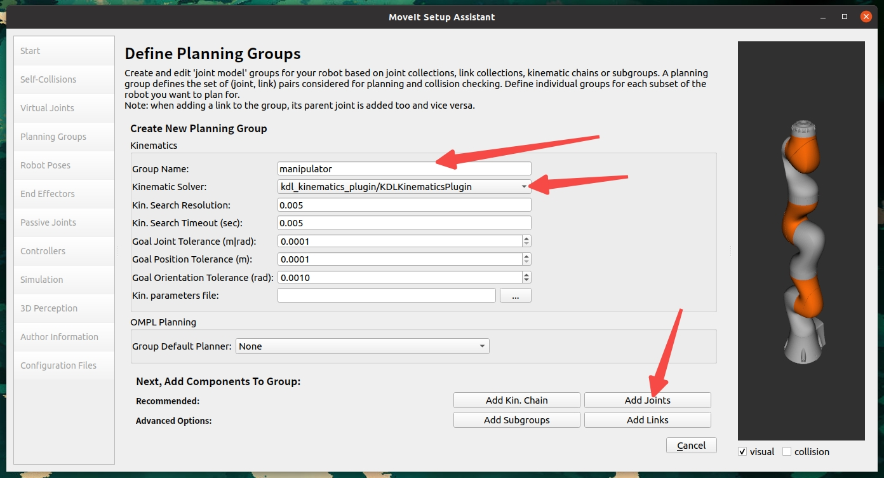
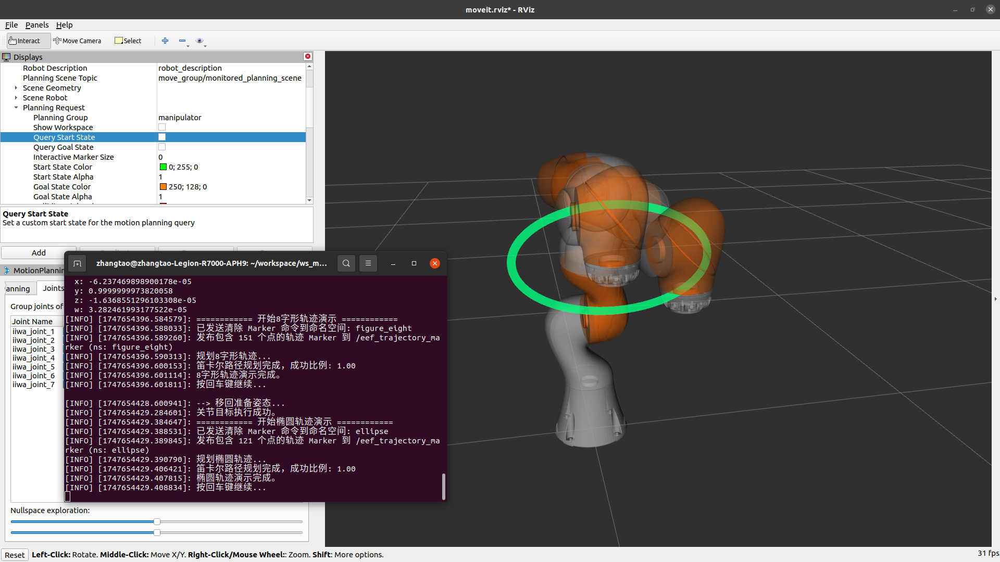

[ROS官方安装教程](https://wiki.ros.org/noetic/Installation/Ubuntu)

[MoveIt官方配置教程](https://moveit.github.io/moveit_tutorials/doc/getting_started/getting_started.html)

[MoveIt Setup Assistant教程](https://moveit.github.io/moveit_tutorials/doc/setup_assistant/setup_assistant_tutorial.html)

下面，我们以Ubuntu20.04为例，[安装ROS1(Noetic)](#ros安装)并[配置MoveIt环境](#moveit配置和安装)进行机械臂的控制以及在Gazebo中完成仿真。
# ROS安装
## 一键安装
```bash
wget -c https://raw.githubusercontent.com/qboticslabs/ros_install_noetic/master/ros_install_noetic.sh && chmod +x ./ros_install_noetic.sh && ./ros_install_noetic.sh
```

##  手动安装
1. 找到系统中的"**软件和更新**"程序，勾选"**restricted**," "**universe**," 还有 "**multiverse**" ，如下图所示：


2. 配置`sources.list`，打开终端(Ctrl+Alt+t)
```bash
sudo sh -c 'echo "deb http://packages.ros.org/ros/ubuntu $(lsb_release -sc) main" > /etc/apt/sources.list.d/ros-latest.list'
```

3. 配置访问Key
```bash
sudo apt install curl       # 确保curl已安装
curl -s https://raw.githubusercontent.com/ros/rosdistro/master/ros.asc | sudo apt-key add -
```

4. 更新软件源并安装ROS
```bash
sudo apt update
sudo apt install ros-noetic-desktop-full # 推荐全量安装
```

5. 环境变量配置(如果同时存在多个ROS系统，建议进行如下配置)
```bash
source /opt/ros/noetic/setup.bash   # 每新开一个终端都要进行配置，以配置不同的ROS系统
```
如果只存在一个ROS系统，可以直接将其添加到系统环境变量(之后无需配置临时环境变量)：
```bash
echo "source /opt/ros/noetic/setup.bash" >> ~/.bashrc
source ~/.bashrc
```

6. 为ROS安装package依赖
```bash
sudo apt install python3-rosdep python3-rosinstall python3-rosinstall-generator python3-wstool build-essential
```

7. 安装并初始化rosdep(依赖管理工具)
```bash
sudo apt install python3-rosdep
sudo rosdep init
rosdep update
```

至此，我们已经完成ROS的安装。接下来，我们需要完成MoveIt的配置：

# MoveIt配置和安装
1. 更新软件源
```bash
rosdep update
sudo apt update
sudo apt dist-upgrade
```

2. 安装构建工具
```bash
sudo apt install ros-noetic-catkin python3-catkin-tools
sudo apt install python3-wstool
```

3. 创建工作区
> 可以自行修改路径，这里我在`home`中创建了`workspace`总工作空间，并在其中创建`moveit`工作空间
```bash
mkdir -p ~/workspace/ws_moveit/src
cd ~/workspace/ws_moveit/src
```

4. 构建工作区
```bash
# 使用二进制包安装MoveIt（比从源码构建更快）
sudo apt install ros-noetic-moveit

# 安装MoveIt附加组件
sudo apt install ros-noetic-moveit-ros-visualization ros-noetic-moveit-planners ros-noetic-moveit-ros-move-group ros-noetic-moveit-ros-perception

# 安装依赖项
cd ~/workspace/ws_moveit/src

# 克隆教程和示例(不必，之后我们会使用URDF文件创建自己的package)
```
至此，我们已经完成基础环境的搭建。之后自行选择合适的机械臂完成配置：

# 导出机械臂相应pkg并安装依赖
这里推荐一个开源URDF文件数据集[awesome-robot-descriptions](https://github.com/robot-descriptions/awesome-robot-descriptions)

我们以`iiwa7机械臂`为例，完成作业要求

1. 下载urdf文件
```bash
cd 替换为实际路径/ws_moveit/src
git clone https://github.com/facebookresearch/differentiable-robot-model.git
```
2. 使用`MoveIt Setup Assistant`导出机械臂package
```bash
sudo apt install ros-noetic-franka-description      # 确保相关程序已安装
roslaunch moveit_setup_assistant setup_assistant.launch
```

- 成功运行后，如图所示点击`Create New MoveIt Configuration Package`：

- 点击`Browse`

- 找到我们的`iiwa7.urdf`文件，双击即可

- 成功加载后会显示机械臂模型


> 注意：如果在加载URDF文件时出现找不到mesh文件的错误，请参考[附录A：解决mesh文件路径问题](#附录a解决mesh文件路径问题)进行修复。

3. 配置机器人组件
   - 自碰撞矩阵配置：点击`Self-Collisions`，然后点击`Generate Collision Matrix`。
   
   
   
   - 虚拟关节配置：点击`Virtual Joints`，添加一个虚拟关节，将机器人固定在世界坐标系。
     - 名称：`virtual_joint`
     - 子链接：`iiwa_link_0`（机器人的基座链接）
     - 父链接：`world`
     - 类型：`fixed`
     
   
   
   - 规划组配置：点击`Planning Groups`，创建一个规划组
     - 名称：`manipulator`
     - 运动学求解器：`KDLKinematicsPlugin`
     - 组配置：包含所有关节（`iiwa_joint_1`到`iiwa_joint_7`）
     
   
   
   
   - 机器人姿态配置：点击`Robot Poses`，添加常用姿态
     - 名称：`home`（回原位姿态）
     - 设置关节角度为初始位置
     - 这里均设置为`0`
     
   
   
   - 末端执行器配置：点击`End Effectors`，添加末端执行器
     - 名称：`end_effector`
     - 组：`manipulator`
     - 父链接：`iiwa_link_7`（机器人的末端链接）
     
   

   - 作者信息填写：点击`Author Information`，自行填写作者信息
     - 维护者名称
     - 维护者邮箱

   

4. 生成配置文件
   - 点击`Configuration Files`
   - 填写配置包的基本信息
     - 名称：`iiwa7_moveit_config`
     - 路径：选择保存的目录，如`~/workspace/ws_moveit/src`
   - 点击`Generate Package`生成配置包
   
   

5. 构建MoveIt配置包
```bash
cd ~/workspace/ws_moveit
catkin build
source devel/setup.bash
```

6. 启动MoveIt演示
```bash
roslaunch iiwa7_moveit_config demo.launch
```

这将启动RViz，显示iiwa7机械臂的模型，并可以通过MoveIt插件进行规划和控制。


# 机械臂控制
我们已经完成机械臂的配置和导入，接下来，我们将实现机械臂的点位控制、轨迹控制（包含8字形轨迹、椭圆轨迹）和避障性能的演示。

## 创建控制包

首先，我们需要创建一个新的ROS包来实现机械臂控制功能：

```bash
# 进入工作空间的src目录
cd ~/workspace/ws_moveit/src

# 创建一个新的ROS包，依赖于MoveIt等相关包
catkin_create_pkg iiwa7_control moveit_ros_planning_interface roscpp rospy std_msgs geometry_msgs

# 创建脚本目录
cd iiwa7_control
mkdir -p scripts
```

接下来，我们可以参考[MoveIt Python Interface教程](https://moveit.github.io/moveit_tutorials/doc/move_group_python_interface/move_group_python_interface_tutorial.html)完成任务。
官方教程十分完善，涉及到很多基础操作和模块。在本项目中，我们会继续指出跟随官方教程可能出现的问题并提出参考解决方案。

我们将参考官方教程示例代码实现具体代码，并将相关功能封装到类（控制器类:`PointControl`）

## 点位控制

点位控制是指控制机械臂的末端执行器按顺序运动到空间中的多个预定义点位。下面我们实现一个Python脚本，控制机械臂运动到6个不同的空间点位：

```bash
# 创建点位控制脚本
touch scripts/point_control.py
chmod +x scripts/point_control.py
```

在[`point_control.py`](./src/iiwa7_control/scripts/point_control.py)中实现以下功能：
### 1. 初始化并获取基本信息
- 初始化ROS节点和MoveIt Commander。
- 获取机器人基本信息，如规划坐标系、末端执行器名称。
- 创建用于在RViz中可视化MoveIt规划轨迹的Publisher。

### 2. 核心控制方法
- `move_J(joint_goal_array)`: 控制机械臂各关节运动到指定的目标角度。
- `go_to(pose_goal)`: 控制机械臂末端执行器运动到空间中的目标位姿 (位置和姿态)。
- `plan_cartesian_path(waypoints)`: 根据给定的路径点列表（`geometry_msgs.msg.Pose`对象），规划笛卡尔空间下的直线运动路径。
- `execute_plan(plan)`: 执行先前规划好的机器人轨迹。

### 3. 交互式六边形轨迹控制 (基于当前末端姿态)
`point_control.py` 脚本在空间中绘制一个正六边形。其特点如下：

- **交互式初始位姿确定**:
    1. 脚本首先会控制机械臂移动到一个预定义的"准备"关节姿态。
    2. 然后程序会暂停，等待用户在RViz中观察并调整（如果需要，可以通过RViz的交互工具微调目标姿态，尽管脚本本身不直接处理这种外部调整）或仅仅是确认当前末端执行器的位姿。
    3. 用户按下回车键后，脚本会捕获末端执行器当前的完整世界位姿（包括位置和姿态/朝向）。

- **六边形平面与中心的定义**:
    - **中心**: 捕获到的末端执行器的世界位置将作为生成六边形的中心点。
    - **平面朝向**: 捕获到的末端执行器的世界姿态（朝向）将决定六边形所在的平面。这意味着六边形会绘制在末端执行器"前方"的、与其当前朝向对齐的平面上。如果末端执行器是水平的，六边形也是水平的；如果末端执行器是倾斜的，六边形也会相应倾斜。
    - **顶点计算**: 六边形的顶点首先在末端执行器的局部坐标系（XY平面，Z为0）中计算，然后通过捕获到的世界位姿变换到世界坐标系中。

- **固定姿态与闭合路径**:
    - **姿态保持**: 在绘制六边形的过程中，末端执行器会尝试保持其在初始捕获时刻的那个姿态。
    - **路径闭合**: 在经过六边形的6个顶点后，脚本会自动添加第7个路径点，该点与六边形的第1个顶点相同，从而使机械臂的运动轨迹形成一个闭合的六边形。

- **参数可调**:
    - 六边形的半径 (`radius`) 可以在脚本的 `run()` 方法中方便地修改。

### 4. 路径可视化增强：Marker显示
为了更清晰地展示期望的末端执行器路径（例如绘制的六边形），除了MoveIt默认的规划路径显示外，`point_control.py` 还增加了以下功能：

- **发布Marker消息**: 脚本会创建一个 `visualization_msgs/Marker` 类型的消息 (具体为 `LINE_STRIP`)，其中包含六边形所有路径点的位置。
- **Marker话题**: 此Marker消息会发布到 `/eef_trajectory_marker` 话题。
- **RViz中配置**:
    1. 在RViz的左侧"Displays"面板中，点击"Add"按钮。
    2. 选择"Marker"显示类型（通常在 `rviz` 或 `visualization_msgs` 分类下）。
    3. 选中新添加的"Marker"Display，在其属性中找到"Marker Topic"一项。
    4. 将其值修改为 `/eef_trajectory_marker`。
    5. 完成后，应该能在RViz中看到一条独立的、默认为红色的线状轨迹，精确地描绘出程序计算出的六边形路径点。

### 5. 运行控制
（运行控制的指令与下方"构建并运行"部分一致，确保先启动 `demo.launch`）

### 6. 避障功能演示与冗余机械臂分析
`point_control.py` 脚本现在也包含了演示MoveIt!的避障规划能力的功能。其工作流程如下：

- **对比规划**:
    1. 脚本首先在没有障碍物的"干净"规划场景中，规划并执行预定义的六边形轨迹。用户可以在RViz中观察到这是一条直接连接六边形顶点的路径。
    2. 随后，脚本会通过 `PlanningSceneInterface` 在规划场景中六边形的某条边附近动态添加一个用户指定大小和位置的盒状障碍物。
    3. 在障碍物存在的情况下，脚本会尝试重新规划并通过相同的六边形目标点序列。

- **观察预期**:
    - 用户将在RViz中清晰地看到两条不同的规划路径：一条是无障碍时的直接路径，另一条则是在有障碍物时，机械臂末端执行器绕开障碍物，并努力完成六边形轨迹的路径。
    - 这直观地展示了MoveIt!在感知到障碍物后动态调整规划路径的能力。需要注意的是，在有障碍物的情况下，笛卡尔路径规划的成功率 (`fraction`) 可能会小于1（表示路径可能不完整或只规划了部分），但也有可能完全成功 (`fraction` = 1)。特别地，由于运动规划算法内部可能存在的随机性或对机器人当前状态（如关节角度的微小差异）的敏感性，即使对于完全相同的障碍物和目标路径点，重复运行 `compute_cartesian_path` 时也可能观察到成功与不成功（或`fraction`值不同）交替出现的现象。最终的规划结果还取决于障碍物的位置/大小、机器人姿态、以及规划参数（如`jump_threshold`、规划时间等）。

- **冗余机械臂的避障优势 (以iiwa7为例)**:
    - KUKA iiwa7 是一款具有7个自由度 (7-DOF) 的冗余机械臂。对于典型的末端执行器6自由度任务（即精确控制其在三维空间中的位置和姿态），iiwa7拥有一个额外的自由度。
    - **什么是冗余自由度?** 这意味着对于同一个末端执行器的目标位姿，iiwa7 可以有无限多种不同的关节 konfigurasi (即手臂的整体形态) 来达成。
    - **冗余如何助力避障?** MoveIt!的运动规划器可以有效利用这种冗余性。当环境中出现障碍物，直接路径被阻挡时：
        - 对于非冗余机械臂 (如6-DOF)，如果其唯一的关节解导致碰撞，那么任务可能无法完成。
        - 对于冗余机械臂，规划器可以探索其自运动空间（即在保持末端执行器位姿不变的情况下活动其余关节），从而找到能够绕过障碍物的替代关节配置和路径。这大大增强了机器人在复杂和动态环境中成功规划和执行任务的能力。
    - `point_control.py` 中的避障演示使用户能够直观地观察到这种利用冗余进行避障的智能行为。机械臂可能会以一种看起来更"迂回"的方式移动其连杆，以确保末端在避开障碍物的同时准确到达目标点。

- **RViz配置提示**:
    - 为获得最佳观察效果，请确保在RViz中已添加并正确配置了"MotionPlanning"显示插件，特别是要启用"Show Scene Geometry"（显示场景物体，包括添加的障碍物）和"Show Planned Path"（显示规划的轨迹）。

## 轨迹控制

轨迹控制是指控制机械臂的末端执行器按照特定轨迹运动，如8字形、椭圆和键鼠控制。以下是实现的代码：

```bash
# 创建轨迹控制脚本
touch scripts/trajectory_control.py
chmod +x scripts/trajectory_control.py
```

在[`trajectory_control.py`](./src/iiwa7_control/scripts/trajectory_control.py)中实现以下功能：

### 1. 初始化与通用控制方法
类似于`point_control.py`，`trajectory_control.py`中的`TrajectoryControl`类会初始化ROS节点和MoveIt!相关组件（`RobotCommander`, `PlanningSceneInterface`, `MoveGroupCommander`）。它提供了基础的运动控制方法：
- `move_J(joint_goal_array)`: 控制机械臂各关节运动到指定的目标角度。
- `plan_cartesian_path(waypoints)`: 根据给定的路径点列表，规划笛卡尔空间下的直线运动路径。
- `execute_plan(plan)`: 执行先前规划好的机器人轨迹。
- `clear_markers(ns)`: 清除RViz中指定命名空间（namespace）下的所有可视化标记 (Markers)。
- `show_trajectory_marker(waypoints_pose_list, ns, r, g, b)`: 在RViz中将指定路径点显示为彩色线条 Marker。在绘制新标记前，会自动调用`clear_markers(ns)`清除同一命名空间下的旧标记，方便调试不同轨迹。

### 2. 轨迹生成与执行

脚本的核心功能是生成并执行特定的几何轨迹。

- **通用准备姿态**: 在执行任何轨迹前，脚本会首先尝试将机械臂移动到一个预定义的、非奇异的"准备"关节姿态。这有助于提高后续笛卡尔路径规划的成功率。
- **获取轨迹中心**: 移动到准备姿态后，会获取当前末端执行器的位姿，该位姿将作为后续轨迹生成的中心参考点。

#### a. 8字形轨迹 (Figure-Eight Trajectory)
- **生成**: `generate_figure_eight_trajectory(scale, steps, center_pose)` 方法使用参数方程生成8字形轨迹的路径点。轨迹默认在以`center_pose`的位置为中心、X坐标固定（即在与机器人基座的YZ平面大致平行的平面上）绘制，并保持`center_pose`的姿态。参数方程（简化形式，theta 从 0 到 2*pi）：
  - `y_local = scale * sin(theta)`
  - `z_local = scale * sin(2*theta) / 2.0`
  这些局部偏移量会加到`center_pose`的对应坐标上。
- **可视化**: 生成的路径点会通过`show_trajectory_marker`以特定颜色（如橙色）发布到RViz中。
- **执行**: 使用`plan_cartesian_path`规划路径，如果规划成功率（`fraction`）达到一定阈值，则通过`execute_plan`执行。

#### b. 椭圆轨迹 (Ellipse Trajectory)
- **生成**: `generate_ellipse_trajectory(radius_a, radius_b, steps, center_pose)` 方法使用参数方程生成椭圆轨迹的路径点。与8字形轨迹类似，它在以`center_pose`为中心的平面上绘制，并保持其姿态。参数方程（简化形式，theta 从 0 到 2*pi）：
  - `y_local = radius_a * cos(theta)`
  - `z_local = radius_b * sin(theta)`
- **可视化**: 椭圆路径点同样会以不同颜色（如青绿色）发布到RViz。
- **执行**: 规划和执行流程与8字形轨迹相同。

### 3. 运行控制脚本
脚本的`run()`方法按顺序执行以下操作：
1. 移动到"准备"姿态。
2. 更新轨迹中心位姿。
3. 生成并执行8字形轨迹。
4. （可选）移回准备姿态或中间姿态。
5. 更新轨迹中心位姿。
6. 生成并执行椭圆轨迹。
7. 移动到"Home"关节姿态（所有关节角度为0）。

确保在运行此脚本前，`demo.launch`（RViz和MoveIt环境）已经启动。

## 构建并运行

编译工作空间并运行控制脚本：

```bash
# 构建工作空间
cd ~/workspace/ws_moveit
catkin build
source devel/setup.bash

# 先启动MoveIt演示环境
roslaunch iiwa7_moveit_config demo.launch
```

在另一个终端中运行点位控制或轨迹控制：

```bash
# 点位控制
source ~/workspace/ws_moveit/devel/setup.bash
rosrun iiwa7_control point_control.py

# 或者轨迹控制
source ~/workspace/ws_moveit/devel/setup.bash
rosrun iiwa7_control trajectory_control.py
```

## 控制效果

1. 点位控制：机械臂的末端执行器会依次移动到6个预定义的空间点位，形成一个空间闭合路径。
   （避障前后的路径对比可以在RViz中观察，具体描述见"避障功能演示与冗余机械臂分析"小节。）
   

2. 8字形轨迹：机械臂的末端执行器会在垂直平面内画出一个8字形轨迹。
   

3. 椭圆轨迹：机械臂的末端执行器会在垂直平面内画出一个椭圆轨迹。
   

4. 避障演示：在 `point_control.py` 脚本的演示中，通过对比有无障碍物时的路径规划，可以观察到：
   - **无障碍时**：机械臂规划并执行直接的、沿预定路径点（如六边形顶点）的轨迹。
   - **有障碍时**：当在路径上添加障碍物后，机械臂能够重新规划，生成一条明显绕开障碍物的轨迹。此规划的成功率（`fraction`）及结果可能因规划算法的特性而有所波动，即使在相同条件下重复运行也可能不完全一致（详细分析见"避障功能演示与冗余机械臂分析"小节）。

     |||
     | ---- | ---- |
     | 无障碍 | 有障碍 |

## 代码分析

1. **初始化**：脚本首先初始化了MoveIt的各种组件，包括RobotCommander、PlanningSceneInterface和MoveGroupCommander，这些组件用于和MoveIt框架交互。同时设置规划时间限制为15秒，比默认的5秒要长，有助于复杂路径的规划。

2. **位姿控制**：使用`go_to`方法实现末端执行器位姿的控制，可以指定空间中的位置和姿态。

3. **笛卡尔路径规划**：使用`plan_cartesian_path`方法规划笛卡尔路径，通过指定一系列中间点位来生成轨迹。它接收三个参数：
   - `waypoints`：路径点列表
   - `eef_step`：末端执行器的步长（0.01m）
   - `jump_threshold`：跳跃阈值（0.0表示不限制）

4. **轨迹生成**：
   - 8字形轨迹：使用参数方程 y = scale * sin(θ), z = scale * sin(2θ) / 2 + offset
   - 椭圆轨迹：使用参数方程 y = a * cos(θ), z = b * sin(θ) + offset

5. **轨迹执行**：使用`execute_plan`方法执行规划好的轨迹，实现机械臂的平滑运动。

使用这种基于MoveIt的轨迹规划和执行方法，可以实现机械臂的复杂运动，同时利用MoveIt的碰撞检测功能确保运动安全。

## 故障排除

如果在执行轨迹时遇到类似"Unable to sample any valid states for goal tree"的错误，可以尝试以下解决方法：

1. 减小轨迹的幅度（scale、radius等参数）
2. 减少路径点的数量（steps参数）
3. 调整起始位置，确保轨迹在机械臂的工作空间内
4. 增加规划时间限制（可通过设置move_group的planning_time参数）

请确保`compute_cartesian_path`方法包含必要的参数（路径点、步长、跳跃阈值和避免碰撞标志）。

### 笛卡尔路径规划失败或fraction为0（机械臂不动）

如果 `compute_cartesian_path` 返回的 `fraction` 很低（例如0.0）或者机械臂在尝试执行笛卡尔路径时没有移动，即使没有明显错误，也可能存在以下问题：

*   **起始姿态接近奇异点**：许多机械臂（包括iiwa7）在完全伸直或某些特定关节角度组合时会处于奇异状态。在奇异点附近，机械臂的雅可比矩阵会变得病态，导致逆运动学求解困难，从而使得笛卡尔空间下的直线运动规划失败。
    *   **解决方案**：在开始任何笛卡尔路径规划（如点位控制或复杂轨迹跟踪）之前，建议首先将机械臂通过**关节空间规划**移动到一个已知的、非奇异的"准备"姿态。例如，可以将所有关节移动到微小偏移的非零角度。
      ```python
      # 示例：移动到一个初始的非奇异关节姿态 (在控制脚本中)
      joint_goal = [0.0, np.deg2rad(20), 0.0, np.deg2rad(-70), 0.0, np.deg2rad(90), 0.0]
      controller.move_J(joint_goal)
      ```

*   **目标点不可达或路径上有障碍物**：确保规划的目标点在机械臂的可达工作空间内，并且路径上没有未知的障碍物（如果启用了碰撞检测）。
*   **笛卡尔路径本身不可行**：即使目标点可达，但如果要求的直线路径导致机械臂关节超出限制或进入自碰撞，规划也会失败。尝试将路径分解为更小的分段，或允许通过中间点进行关节空间移动。
*   **规划时间不足**：对于复杂的笛卡尔路径，默认的规划时间可能不够。可以尝试增加规划时间（例如，在 `Iiwa7Controller` 的 `__init__` 方法中，或者在规划前临时设置）：
    ```python
    # self.move_group.set_planning_time(15.0) # 增加规划时间
    ```

# 附录
## 附录A：解决mesh文件路径问题

如果在加载URDF文件时出现以下错误：
```
Error retrieving file [meshes/iiwa7/collision/link_0.stl]: Could not resolve host: meshes
```

这是因为URDF文件中的mesh文件路径不正确。需要修改URDF文件中的mesh路径，添加`package://`前缀并指向正确的包路径：

```bash
# 找到URDF文件
find ~/workspace/ws_moveit/src -name "iiwa7.urdf"

# 编辑URDF文件，将所有mesh路径从类似
# <mesh filename="meshes/iiwa7/visual/link_0.stl"/>
# 修改为
# <mesh filename="package://differentiable-robot-model/diff_robot_data/kuka_iiwa/meshes/iiwa7/visual/link_0.stl"/>
```

此外，还需要将differentiable-robot-model目录配置为ROS包，以便ROS能够找到这些文件：

```bash
# 创建package.xml文件
cd ~/workspace/ws_moveit/src/differentiable-robot-model
cat > package.xml << EOL
<?xml version="1.0"?>
<package format="2">
  <name>differentiable-robot-model</name>
  <version>0.1.0</version>
  <description>Differentiable Robot Model Package</description>

  <maintainer email="user@example.com">User</maintainer>
  <license>MIT</license>
  
  <buildtool_depend>catkin</buildtool_depend>
  <build_depend>roscpp</build_depend>
  <build_depend>rospy</build_depend>
  <build_depend>std_msgs</build_depend>
  
  <exec_depend>roscpp</exec_depend>
  <exec_depend>rospy</exec_depend>
  <exec_depend>std_msgs</exec_depend>
  
  <export>
  </export>
</package>
EOL
```

```bash
# 创建CMakeLists.txt文件
cat > CMakeLists.txt << EOL
cmake_minimum_required(VERSION 3.0.2)
project(differentiable-robot-model)

find_package(catkin REQUIRED COMPONENTS
  roscpp
  rospy
  std_msgs
)

catkin_package(
  CATKIN_DEPENDS roscpp rospy std_msgs
)

include_directories(
  \${catkin_INCLUDE_DIRS}
)

## Mark mesh files for installation
install(DIRECTORY diff_robot_data
  DESTINATION \${CATKIN_PACKAGE_SHARE_DESTINATION}
  FILES_MATCHING PATTERN "*.stl" PATTERN "*.urdf" PATTERN "*.xacro"
)
EOL
```

```bash
# 重新构建工作空间
cd ~/workspace/ws_moveit
catkin build
source devel/setup.bash
```

修改后再次运行Setup Assistant：
```bash
roslaunch moveit_setup_assistant setup_assistant.launch
```

修复后应该可以成功加载机械臂模型。

## 附录B：六边形顶点坐标变换推导

在 `point_control.py` 脚本的交互式六边形绘制功能中，核心步骤之一是将局部计算的六边形顶点变换到世界坐标系中，该变换基于用户确认时末端执行器的实时位姿。以下是这个变换过程的简要推导：

**1. 目标**

我们希望在末端执行器当前位置和姿态所定义的"前方"平面上绘制一个正六边形。

**2. 初始信息**

- 末端执行器在世界坐标系下的位姿，捕获自用户确认时刻：
    - 世界位置: $ P_{ee\_world} = (x_w, y_w, z_w) $
    - 世界姿态 (四元数): $ Q_{ee\_world} = (q_x, q_y, q_z, q_w) $
- 六边形用户定义参数：
    - 半径: $ r $
    - 顶点数量: $ N $ (脚本中固定为6)

**3. 步骤1：在末端执行器的局部坐标系中计算顶点**

首先，我们在末端执行器的局部坐标系中定义六边形的顶点。我们假设六边形的中心位于该局部坐标系的原点 $(0,0,0)$，并且六边形"平躺"在该局部坐标系的XY平面上 (即局部Z坐标为0)。

对于第 $i$ 个顶点 (其中 $i$ 从 0 到 $N-1$)，其在局部坐标系中的坐标 $V_{local,i} = (x_{local,i}, y_{local,i}, z_{local,i})$ 计算如下：

$$ x_{local,i} = r \cdot \cos\left(\frac{2\pi i}{N}\right) $$
$$ y_{local,i} = r \cdot \sin\left(\frac{2\pi i}{N}\right) $$
$$ z_{local,i} = 0 $$

为了进行后续的齐次坐标变换，我们将每个局部顶点表示为一个齐次坐标列向量：
$$ V_{local,i} = \begin{bmatrix} x_{local,i} \\ y_{local,i} \\ 0 \\ 1 \end{bmatrix} $$

**4. 步骤2：构建从局部坐标系到世界坐标系的变换矩阵**

为了将局部坐标系下的顶点转换到世界坐标系，我们需要一个 $4 \times 4$ 的齐次变换矩阵 $T_{world\_from\_local}$。这个矩阵同时包含了旋转和平移操作，可以将点从末端执行器的局部坐标系映射到世界坐标系。

该矩阵的结构如下：

$$
T_{world\_from\_local} = \begin{bmatrix}
R_{world\_from\_local} & P_{ee\_world} \\
\begin{matrix} 0 & 0 & 0 \end{matrix} & 1
\end{bmatrix}
$$

其中：
- $R_{world\_from\_local}$ 是一个 $3 \times 3$ 的旋转矩阵，它根据末端执行器在世界坐标系中的姿态四元数 $Q_{ee\_world}$ 计算得到。它描述了局部坐标系的轴相对于世界坐标系轴的旋转关系。
- $P_{ee\_world}$ 是一个 $3 \times 1$ 的平移列向量，代表末端执行器（即局部坐标系原点）在世界坐标系中的位置 $(x_w, y_w, z_w)^T$。

在Python脚本中，我们利用 `tf.transformations.quaternion_matrix(eef_orientation_list)` 来获取一个基于四元数的 $4 \times 4$ 矩阵。这个函数返回的矩阵的左上角 $3 \times 3$ 部分就是我们需要的旋转矩阵 $R_{world\_from\_local}$，其最后一列的前三个元素初始可能为0。我们随后手动将世界位置 $P_{ee\_world}$ 填充到这个矩阵的最后一列（平移部分）：

```python
# eef_orientation_list 是从 Q_ee_world 转换来的列表 [qx, qy, qz, qw]
T_world_from_local = quaternion_matrix(eef_orientation_list)

# 设置平移部分
T_world_from_local[0,3] = hexagon_center_pose_world.position.x # x_w
T_world_from_local[1,3] = hexagon_center_pose_world.position.y # y_w
T_world_from_local[2,3] = hexagon_center_pose_world.position.z # z_w
```

**5. 步骤3：将局部顶点变换到世界坐标系**

对于每一个在局部坐标系中计算得到的齐次顶点 $V_{local,i}$，我们可以通过左乘变换矩阵 $T_{world\_from\_local}$ 来得到其在世界坐标系中的齐次坐标 $V_{world,i}$：

$$ V_{world,i} = T_{world\_from\_local} \cdot V_{local,i} $$

展开后，$V_{world,i} = [x_{world,i}, y_{world,i}, z_{world,i}, 1]^T$。我们提取其前三个元素 $(x_{world,i}, y_{world,i}, z_{world,i})$ 作为该顶点在世界坐标系下的笛卡尔坐标。

**6. 最终的路径点**

每个计算出的世界坐标顶点 $(x_{world,i}, y_{world,i}, z_{world,i})$ 与最初捕获的末端执行器世界姿态四元数 $Q_{ee\_world}$ (作为目标姿态) 一起，构成了一个完整的路径点 (`geometry_msgs.msg.Pose` 对象)，用于后续的笛卡尔路径规划。

# MoveIt + Gazebo 联合仿真配置

为了在Gazebo中对`iiwa7`机械臂进行仿真并通过MoveIt进行控制，我们需要进行以下配置：

## 1. URDF配置检查

确保URDF文件 (`iiwa7.urdf`) 包含Gazebo仿真所需的元素：
- **`<transmission>` 标签**: 为每个非固定关节定义传动装置。这对于`ros_control`与Gazebo的硬件接口进行交互至关重要。
  ```xml
  <transmission name="iiwa_tran_1">
    <type>transmission_interface/SimpleTransmission</type>
    <joint name="iiwa_joint_1">
      <hardwareInterface>hardware_interface/PositionJointInterface</hardwareInterface> <!-- 或者 VelocityJointInterface, EffortJointInterface -->
    </joint>
    <actuator name="iiwa_motor_1">
      <hardwareInterface>hardware_interface/PositionJointInterface</hardwareInterface>
      <mechanicalReduction>1</mechanicalReduction>
    </actuator>
  </transmission>
  <!-- 为其他关节重复此操作 -->
  ```
  > `iiwa7.urdf` 文件中已包含适用于 `PositionJointInterface` 的 `transmission` 标签。

- **Gazebo插件**: 包括用于物理属性、传感器和`ros_control`的插件。
  ```xml
  <gazebo>
    <plugin name="gazebo_ros_control" filename="libgazebo_ros_control.so">
      <robotNamespace>/iiwa</robotNamespace> <!-- 与控制器和话题的命名空间匹配 -->
    </plugin>
  </gazebo>
  ```
  > `iiwa7.urdf` 文件中已包含此插件。

## 2. 创建控制器配置文件

在 `iiwa7_moveit_config/config` 目录下创建一个名为 `controllers.yaml` 的文件。这个文件定义了 `ros_control` 将要加载的控制器类型和控制的关节。

[`iiwa7_moveit_config/config/controllers.yaml`](./src/iiwa7_moveit_config/config/controllers.yaml):
```yaml
# MoveIt使用的上层轨迹控制器控制参数
iiwa_arm_controller:
  type: position_controllers/JointTrajectoryController # 或者 effort_controllers/JointTrajectoryController 等
  joints:
    - iiwa_joint_1
    - iiwa_joint_2
    - iiwa_joint_3
    - iiwa_joint_4
    - iiwa_joint_5
    - iiwa_joint_6
    - iiwa_joint_7
  gains: # 根据需要调整PID增益
    iiwa_joint_1: {p: 100, d: 1, i: 1, i_clamp: 1}
    iiwa_joint_2: {p: 100, d: 1, i: 1, i_clamp: 1}
    iiwa_joint_3: {p: 100, d: 1, i: 1, i_clamp: 1}
    iiwa_joint_4: {p: 100, d: 1, i: 1, i_clamp: 1}
    iiwa_joint_5: {p: 100, d: 1, i: 1, i_clamp: 1}
    iiwa_joint_6: {p: 100, d: 1, i: 1, i_clamp: 1}
    iiwa_joint_7: {p: 100, d: 1, i: 1, i_clamp: 1}

# Gazebo仿真参数，自行调整，下面是一个示例
gazebo_ros_control:
  pid_gains:
    iiwa_joint_1: {p: 100, i: 0, d: 1}
    iiwa_joint_2: {p: 100, i: 0, d: 1}
    iiwa_joint_3: {p: 100, i: 0, d: 1}
    iiwa_joint_4: {p: 100, i: 0, d: 1}
    iiwa_joint_5: {p: 100, i: 0, d: 1}
    iiwa_joint_6: {p: 100, i: 0, d: 1}
    iiwa_joint_7: {p: 100, i: 0, d: 1}

joint_state_controller:
  type: joint_state_controller/JointStateController
  publish_rate: 50
```

### 理解 `controllers.yaml` 中的两组PID参数

你可能注意到 `controllers.yaml` 文件中定义了两组看起来相似的PID（或PD）增益参数，它们分别位于 `iiwa_arm_controller` 下的 `gains` 和 `gazebo_ros_control` 下的 `pid_gains`。这两组参数服务于ROS控制栈的不同层面，通常需要独立调整，其值也无需保持一致：

1.  **`iiwa_arm_controller/gains`**:
    *   **作用对象**: 这些增益是为 `ros_control` 框架中的上层控制器（在此例中是 `position_controllers/JointTrajectoryController`，即 `iiwa_arm_controller`）配置的。
    *   **控制目标**: `JointTrajectoryController` 负责接收一个期望的关节轨迹（包含时间戳、位置、可能还有速度和加速度），并根据这条轨迹计算出在每个控制周期应该发送给"底层硬件"（在仿真中即 `gazebo_ros_control` 插件）的指令。对于 `PositionJointInterface`，它会发送期望的关节位置。
    *   **影响**: 这组 `gains` 主要影响 `JointTrajectoryController` 如何跟踪输入的目标轨迹，如何平滑地在轨迹段之间过渡，以及如何响应跟踪误差来生成这些发送给底层的指令。如果底层（Gazebo的PID）已经能很好地跟踪位置，这组参数的影响可能不那么直接，但对于整体轨迹的平顺性和动态响应仍有作用。
    *   **注释中的 `i: 1`**: 在你当前 `README.md` 示例的 `iiwa_arm_controller` 的 `gains` 中，`i`（积分项）被设为 `1`。在实际的 `controllers.yaml` 文件中，我们已经将其设为 `0`。通常建议将积分项设为 `0` 开始调试，以避免积分饱和问题，尤其是在位置控制模式下。

2.  **`gazebo_ros_control/pid_gains`**:
    *   **作用对象**: 这些 `pid_gains` 是专门为 Gazebo 中的 `gazebo_ros_control` 插件配置的。
    *   **控制目标**: 当上层的 `JointTrajectoryController` 通过 `PositionJointInterface` 向 Gazebo 中的模拟关节发送一个目标位置时，`gazebo_ros_control` 插件会利用**这些PID增益**在 Gazebo 的物理引擎中施加计算出的力或扭矩，以驱动模拟关节达到并稳定地保持在该目标位置。它们直接模拟了真实机器人硬件底层伺服控制器的行为。
    *   **影响**: 这组PID参数直接决定了机器人在Gazebo仿真环境中的"物理"表现：关节的刚度（P）、阻尼（D）、对外部扰动（如重力、碰撞）的抵抗能力，以及对目标指令的响应速度和稳定性。如果这些值不当，机器人模型在仿真中可能会显得"软弱"、抖动、过冲或振荡，即使上层控制器发送了完美的指令。Gazebo控制台通常会在缺少这些参数时报告 "No p gain specified for pid..."。

**总结与调优**:

*   **`gazebo_ros_control/pid_gains` 是基础**: 通常应首先调整这些参数，确保机器人在Gazebo中能够稳定地保持姿态，并且对单个目标点的响应良好（不过冲、不振荡、能抵抗重力）。这是实现良好仿真效果的基石。
*   **`iiwa_arm_controller/gains` 负责轨迹跟踪**: 在底层Gazebo PID调优良好的基础上，如果轨迹跟踪的动态性能（如快速运动时的滞后、轨迹段切换时的平滑度）仍需改善，可以再调整 `JointTrajectoryController` 自身的 `gains`。
*   **独立调整**: 由于它们的目标和运行环境不同，这两组参数的最佳值通常是不同的，需要分别进行调优。

通过这样的分层控制和参数配置，MoveIt才能在Gazebo仿真环境中实现精确和稳定的机械臂运动控制。

## 3. 创建Gazebo启动文件

在 `iiwa7_moveit_config/launch` 目录下创建一个名为 `iiwa7_gazebo.launch` 的文件。此文件将启动Gazebo，加载机器人模型，并启动控制器。

[`iiwa7_moveit_config/launch/iiwa7_gazebo.launch`](./src/iiwa7_moveit_config/launch/iiwa7_gazebo.launch):
```xml
<launch>
  <!-- Gazebo arguments -->
  <arg name="paused" default="false"/>
  <arg name="use_sim_time" default="true"/>
  <arg name="gui" default="true"/>
  <arg name="headless" default="false"/>
  <arg name="debug" default="false"/>
  <arg name="world_name" default="worlds/empty.world"/>

  <!-- Startup Gazebo server and client -->
  <include file="$(find gazebo_ros)/launch/empty_world.launch">
    <arg name="world_name" value="$(arg world_name)"/>
    <arg name="debug" value="$(arg debug)" />
    <arg name="gui" value="$(arg gui)" />
    <arg name="paused" value="$(arg paused)"/>
    <arg name="use_sim_time" value="$(arg use_sim_time)"/>
    <arg name="headless" value="$(arg headless)"/>
  </include>

  <!-- Load the URDF into the ROS Parameter Server -->
  <param name="robot_description" command="$(find xacro)/xacro '''$(find differentiable-robot-model)/diff_robot_data/kuka_iiwa/urdf/iiwa7.urdf'''" />

  <!-- Run a python script to send a service call to gazebo_ros to spawn a URDF robot -->
  <node name="urdf_spawner" pkg="gazebo_ros" type="spawn_model" respawn="false" output="screen"
        args="-urdf -model iiwa7 -param robot_description -x 0 -y 0 -z 0.1"/>

  <!-- Load joint controller configurations from YAML file to parameter server -->
  <rosparam file="$(find iiwa7_moveit_config)/config/controllers.yaml" command="load" ns="/iiwa" />

  <!-- Load the controllers (load + start) -->
  <node name="controller_spawner" pkg="controller_manager" type="spawner" respawn="false"
    output="screen" ns="/iiwa" args="iiwa_arm_controller joint_state_controller"/>
    
  <!-- Robot State Publisher -->
  <node name="robot_state_publisher" pkg="robot_state_publisher" type="robot_state_publisher" respawn="true" output="screen">
      <param name="publish_frequency" type="double" value="50.0" />
      <param name="tf_prefix" type="string" value="" />
  </node>

  <!-- Relay /iiwa/joint_states to global /joint_states so MoveIt can consume -->
  <node name="joint_states_relay" pkg="topic_tools" type="relay" args="/iiwa/joint_states /joint_states" output="screen" />

</launch> 
```

## 4. 启动MoveIt与Gazebo集成

MoveIt的 `demo.launch` 文件 (位于 `iiwa7_moveit_config/launch/`) 通常有一个参数用于指定控制器管理器。为了连接到Gazebo中通过 `ros_control` 管理的控制器，我们需要将此参数设置为 `ros_control`。

启动流程:
1.  **编译工作空间**:
    ```bash
    cd ~/workspace/ws_moveit
    catkin build
    source devel/setup.bash
    ```
2.  **启动Gazebo和控制器**:
    在一个新的终端中运行：
    ```bash
    roslaunch iiwa7_moveit_config iiwa7_gazebo.launch
    ```
    Gazebo 将会启动，并且机器人模型会被加载和生成。

3.  **启动MoveIt (连接到Gazebo)**:
    在另一个新的终端中运行：
    ```bash
    roslaunch iiwa7_moveit_config demo.launch moveit_controller_manager:=ros_control
    ```
    这将启动MoveIt的 `move_group` 节点和RViz。在RViz中，确保 "Fixed Frame" 设置为 `world` 或 `iiwa_link_0` (或你URDF中定义的基座链接)，并且 "MotionPlanning" 显示插件的 "Planning Scene Topic" 设置为 `/move_group/monitored_planning_scene`（通常是默认值）。

# 使用MoveIt API控制Gazebo中的机械臂

在成功启动Gazebo和MoveIt之后，你之前为RViz虚拟控制编写的Python脚本 (`point_control.py`, `trajectory_control.py`) 现在可以用来控制在Gazebo中仿真的机械臂。

确保脚本中使用的 `MoveGroupCommander` 的 `group_name` (例如, "manipulator") 与你在MoveIt Setup Assistant中配置的规划组名称一致。

## 运行控制脚本

1.  确保Gazebo和MoveIt已经按照上一节的说明启动。
2.  打开一个新的终端。
3.  `source` 工作空间：
    ```bash
    source ~/workspace/ws_moveit/devel/setup.bash
    ```
4.  运行你的Python控制脚本：
    ```bash
    # 例如，运行点位控制脚本
    rosrun iiwa7_control point_control.py

    # 或者，运行轨迹控制脚本
    rosrun iiwa7_control trajectory_control.py
    ```
    机械臂现在应该在Gazebo环境中根据脚本指令运动。

## Gazebo控制效果

(这部分可以后续补充Gazebo中的截图)

- **点位控制**: 机械臂末端在Gazebo中按顺序到达预定义点。
- **轨迹控制**: 机械臂末端在Gazebo中绘制8字形和椭圆轨迹。
- **避障**: 如果在Gazebo环境中添加障碍物（可以通过Gazebo的GUI或服务调用添加），并重新运行包含避障逻辑的脚本，MoveIt将规划并执行避开这些物理障碍物的路径。

# Gazebo 联合仿真常见问题与关键修改（总结）

> 下面汇总本次在 **Gazebo + MoveIt** 联合仿真中遇到的主要问题及对应修改，方便后续复现或排查。配置文件路径均相对于 `~/workspace/ws_moveit/`。

## 1. 机械臂在 Gazebo 中倒塌
- **现象**：启动 Gazebo 后，机械臂模型整体因重力下落，导致后续运动规划与执行立即失败或与预期严重不符。
- **原因**：URDF 中定义的机器人基座连杆（例如 `iiwa_link_0`）没有被固定到 Gazebo 的世界坐标系 (`world`)。
- **解决**：在机器人 URDF 文件 (`src/differentiable-robot-model/diff_robot_data/kuka_iiwa/urdf/iiwa7.urdf`) 的末尾（但在 `</robot>` 标签之前）添加一个固定的 `world` 连杆和一个连接 `world` 与机器人基座连杆的固定关节。
  ```xml
  <!-- Define a static world link -->
  <link name="world"/>

  <!-- Fix the robot's base_link to the world link -->
  <joint name="world_joint" type="fixed">
    <parent link="world"/>
    <child link="iiwa_link_0"/> <!-- 替换为你的机器人实际的基座连杆名称 -->
    <origin xyz="0 0 0" rpy="0 0 0"/>
  </joint>
  ```
  **注意**: 如果你的 MoveIt 配置包 (`.srdf` 文件) 中已存在一个连接 `world` 和基座的虚拟关节 (virtual_joint)，例如:
  `<virtual_joint name="virtual_joint" type="fixed" parent_frame="world" child_link="iiwa_link_0" />`
  这个虚拟关节主要服务于 MoveIt 的规划场景。为了 Gazebo 中的物理固定，上述 URDF 修改仍然是必要的。两者可以共存。

## 2. Gazebo 控制器报错 `No p gain specified for pid` / Controller fails to load
- **现象**：Gazebo 启动时，控制台反复打印针对每个关节的 "No p gain specified for pid" 类似错误，导致 `gazebo_ros_control` 插件无法正确加载或初始化 `JointTrajectoryController`。
- **原因**：`gazebo_ros_control` 插件（特别是用于 `PositionJointInterface` 或 `VelocityJointInterface` 的控制器）期望在 ROS 参数服务器上找到每个受控关节的 PID 增益。这些参数需要在 `gazebo_ros_control` 插件自身查找的特定命名空间下。
- **解决**：
    1.  **URDF 配置**: 确保你的 URDF (`iiwa7.urdf`) 中 `<gazebo>` 插件和 `<transmission>` 标签内都指定了正确的 `<robotNamespace>` (例如 `/iiwa`)。
        ```xml
        <!-- In URDF, inside <robot> tag -->
        <gazebo>
          <plugin filename="libgazebo_ros_control.so" name="gazebo_ros_control">
            <robotNamespace>/iiwa</robotNamespace> <!-- 确保与 controllers.yaml 加载和控制器启动的命名空间一致 -->
          </plugin>
        </gazebo>

        <!-- Example for one transmission block, repeat for all non-fixed joints -->
        <transmission name="iiwa_tran_1">
          <robotNamespace>/iiwa</robotNamespace> <!-- Crucial for PID gain lookup -->
          <type>transmission_interface/SimpleTransmission</type>
          <joint name="iiwa_joint_1">
            <hardwareInterface>hardware_interface/PositionJointInterface</hardwareInterface>
          </joint>
          <actuator name="iiwa_motor_1">
            <hardwareInterface>hardware_interface/PositionJointInterface</hardwareInterface>
            <mechanicalReduction>1</mechanicalReduction>
          </actuator>
        </transmission>
        ```
    2.  **控制器配置文件 (`controllers.yaml`)**: 在 `src/iiwa7_moveit_config/config/controllers.yaml` 文件中，为 `gazebo_ros_control` 添加 `pid_gains`。这些参数需要通过 `rosparam load` 命令加载到与 URDF 中 `<robotNamespace>` 匹配的命名空间下 (见 `iiwa7_gazebo.launch` 的修改)。
        ```yaml
        # src/iiwa7_moveit_config/config/controllers.yaml

        # Controllers for MoveIt (these gains are primarily for ros_control's JointTrajectoryController itself)
        iiwa_arm_controller:
          type: position_controllers/JointTrajectoryController
          joints:
            - iiwa_joint_1 # ... and other joints
            # ...
          gains: # Optional: Default gains for the controller, can be overridden by gazebo_ros_control specifics
            iiwa_joint_1: {p: 100, d: 1, i: 0, i_clamp: 1}
            # ...

        # Specific PID gains for Gazebo simulation, loaded under <robotNamespace>/gazebo_ros_control/pid_gains/
        gazebo_ros_control:
          pid_gains:
            iiwa_joint_1: {p: 100, i: 0, d: 10} # Initial P, I, D values. Tune as needed.
            iiwa_joint_2: {p: 100, i: 0, d: 10}
            # ... repeat for all 7 joints
            iiwa_joint_7: {p: 100, i: 0, d: 10}

        joint_state_controller:
          type: joint_state_controller/JointStateController
          publish_rate: 50
        ```
    3.  **Gazebo 启动文件 (`iiwa7_gazebo.launch`)**: 确保 `controllers.yaml` 加载到正确的命名空间。
        ```xml
        <!-- src/iiwa7_moveit_config/launch/iiwa7_gazebo.launch -->
        <!-- Load joint controller configurations from YAML file to parameter server -->
        <!-- Note the ns="/iiwa" attribute -->
        <rosparam file="$(find iiwa7_moveit_config)/config/controllers.yaml" command="load" ns="/iiwa" />

        <!-- Load the controllers, also under the /iiwa namespace -->
        <node name="controller_spawner" pkg="controller_manager" type="spawner" respawn="false"
              output="screen" ns="/iiwa" args="iiwa_arm_controller joint_state_controller"/>
        ```
- **调优建议**:
    - `i` (积分项) 通常建议在初始调试时设为 `0`，以避免积分饱和问题。
    - `p` (比例项) 和 `d` (微分项) 需要根据机器人实际表现进行调整。对于 KUKA iiwa，常见的起始值范围： `p` 在 100 到 800 之间，`d` 在 1 到 30 之间。如果机器人抖动，尝试增加 `d`；如果响应慢或有静差，尝试增加 `p`。

## 3. Gazebo 警告 `<hardwareInterface>` 语法已弃用 / Deprecated syntax for `<hardwareInterface>`
- **现象**：Gazebo 启动时或加载 URDF 时，日志中出现关于 `<hardwareInterface>` 标签语法已弃用的警告，提示缺少 `hardware_interface/` 前缀。
- **原因**：较新版本的 `ros_control` 和 `gazebo_ros_control` 要求 `hardwareInterface` 标签的内容包含完整的接口类型名称，例如 `hardware_interface/PositionJointInterface`。
- **解决**：编辑 URDF 文件 (`iiwa7.urdf`)，在所有 `<transmission>` 标签内部的 `<joint>` 和 `<actuator>` 的 `<hardwareInterface>` 标签中，为其内容添加 `hardware_interface/` 前缀。
  **修改前示例**:
  ```xml
  <hardwareInterface>PositionJointInterface</hardwareInterface>
  ```
  **修改后示例**:
  ```xml
  <hardwareInterface>hardware_interface/PositionJointInterface</hardwareInterface>
  ```
  确保对 URDF 中所有相关的 `<hardwareInterface>` 都进行此修改。

## 4. MoveIt 执行失败: `Unable to identify any set of controllers` / `CONTROL_FAILED`
- **现象**：在 RViz 中使用 MoveIt 进行运动规划（Plan）看起来成功，但在尝试执行（Execute）时，MoveIt 界面或终端报错 "Unable to identify any set of controllers for group..." 或 "Action failed: CONTROL_FAILED"。
- **原因**：MoveIt 的控制器管理器 (`moveit_ros_control_interface::MoveItControllerManager`) 默认在根命名空间 (`/`) 下查找 `controller_manager` 服务（如 `query_controller_states`）。如果 Gazebo 中的控制器（由 `gazebo_ros_control` 管理）实际运行在一个子命名空间下（例如 `/iiwa`），MoveIt 将无法找到它们。
- **解决**：需要告知 MoveIt 控制器实际所在的命名空间。修改 `iiwa7_moveit_config/launch/ros_control_moveit_controller_manager.launch.xml` (此文件通常由 `demo.launch` 或 `move_group.launch` 包含):
  ```xml
  <!-- src/iiwa7_moveit_config/launch/ros_control_moveit_controller_manager.launch.xml -->
  <launch>
    <!-- Define MoveIt controller manager plugin -->
    <param name="moveit_controller_manager" value="moveit_ros_control_interface::MoveItControllerManager" />

    <!-- Tell MoveIt where the controller_manager services are running -->
    <!-- This should match the namespace used in gazebo_ros_control plugin and controller_spawner -->
    <param name="ros_control_namespace" value="/iiwa" />
  </launch>
  ```

## 5. MoveIt 无法获取当前机器人状态 / `Failed to fetch current robot state`
- **现象**：MoveIt 启动时或 Python 控制脚本尝试连接 `MoveGroupCommander` 时，出现 "Failed to fetch current robot state" 或类似错误，导致无法获取到机器人的实时关节状态。场景中的机器人模型可能停留在初始姿态。
- **原因**：`joint_state_controller` (在 `/iiwa` 命名空间下运行) 将关节状态发布到带命名空间的话题 `/iiwa/joint_states`。然而，MoveIt (`move_group` 节点) 以及 `robot_state_publisher` (如果未特别配置) 默认监听根命名空间下的 `/joint_states` 话题。
- **解决**：在 Gazebo 的启动文件 (`iiwa7_gazebo.launch`) 中添加一个 `topic_tools/relay` 节点，将带命名空间的 `/iiwa/joint_states` 话题内容转发到根命名空间的 `/joint_states` 话题。
  ```xml
  <!-- src/iiwa7_moveit_config/launch/iiwa7_gazebo.launch -->
  <!-- ... (other nodes like urdf_spawner, controller_spawner) ... -->

  <!-- Robot State Publisher (listens to /joint_states by default) -->
  <node name="robot_state_publisher" pkg="robot_state_publisher" type="robot_state_publisher" respawn="true" output="screen">
      <param name="publish_frequency" type="double" value="50.0" />
      <!-- <param name="tf_prefix" type="string" value="" /> --> <!-- Typically not needed if base_link is iiwa_link_0 -->
  </node>

  <!-- Relay /iiwa/joint_states to global /joint_states so MoveIt and robot_state_publisher can consume -->
  <node name="joint_states_relay" pkg="topic_tools" type="relay"
        args="/iiwa/joint_states /joint_states" output="screen"/>
  ```
  **确保**: `robot_state_publisher` 也在你的 Gazebo 启动文件中运行，并且它能正确订阅到最终的 `/joint_states` 话题。

## 6. 运动执行时控制器报错 `GOAL_TOLERANCE_VIOLATED`
- **现象**：机械臂尝试执行轨迹，但在到达目标点之前或之后不久，控制台（通常是运行 `move_group` 的终端）出现 `*_trajectory_controller: Goal Torelance Violated` 错误，MoveIt 报告执行失败。
- **原因**：这通常意味着控制器无法在规定的容差内精确地达到或维持目标关节位置。可能的原因包括：
    - PID 参数仍然不够优化（尤其是 `p` 和 `d`）。
    - 期望的轨迹对于当前 PID 设置来说过于激进（速度或加速度过大）。
    - Gazebo 仿真物理特性（如关节阻尼、摩擦）与控制器期望不符。
    - 关节本身的目标容差 (`goal` constraint) 或停止速度容差 (`stopped_velocity_tolerance`) 设置过于严格。
- **解决与调优建议**：
    1.  **PID 进一步调优**: 这是首要步骤。参考问题2中的 PID 调优建议，耐心调整 `p` 和 `d` 值。
    2.  **检查轨迹平滑性**: 如果是自定义轨迹，确保其平滑且在机器人动力学能力范围内。
    3.  **调整控制器容差 (在 `controllers.yaml` 中)**: 在 `src/iiwa7_moveit_config/config/controllers.yaml` 中，可以为 `iiwa_arm_controller` 添加或调整 `constraints` 部分。
        ```yaml
        # src/iiwa7_moveit_config/config/controllers.yaml
        iiwa_arm_controller:
          type: position_controllers/JointTrajectoryController
          joints: # ...
          # gains: # ...
          constraints:
            stopped_velocity_tolerance: 0.05      # 默认可能是 0.01 rad/s。适当放宽有助于避免因微小震荡误报。
            goal_time: 0.5                         # 到达目标点后，允许0.5秒的稳定时间。默认可能是0。
            # Per-joint goal tolerance (radians)
            iiwa_joint_1: {trajectory: 0.05, goal: 0.02} # trajectory是路径点容差，goal是最终点容差
            iiwa_joint_2: {trajectory: 0.05, goal: 0.02}
            # ... repeat for all 7 joints
            iiwa_joint_7: {trajectory: 0.05, goal: 0.02}
        ```
        **注意**: 这些容差值需要根据你的具体应用需求来设定。过度放宽可能导致精度下降。
    4.  **检查 URDF 物理参数**: 虽然不常见，但如果 URDF 中的惯性参数、关节阻尼等与实际机器人差异过大，也可能影响控制稳定性。

---

**启动顺序建议**：
1.  **编译**: `catkin build` (在 `~/workspace/ws_moveit/` 目录下)
2.  **Source**: `source devel/setup.bash`
3.  **启动 Gazebo 和控制器**: 在一个终端中运行 `roslaunch iiwa7_moveit_config iiwa7_gazebo.launch`
4.  **启动 MoveIt**: 在另一个终端中运行 `roslaunch iiwa7_moveit_config demo.launch moveit_controller_manager:=ros_control`
5.  **运行控制脚本 (可选)**: 在第三个终端中运行你的 Python 控制脚本 (例如 `rosrun iiwa7_control point_control.py`)。
