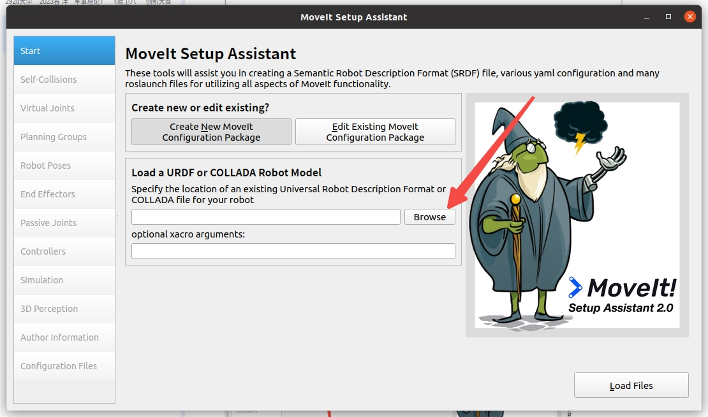
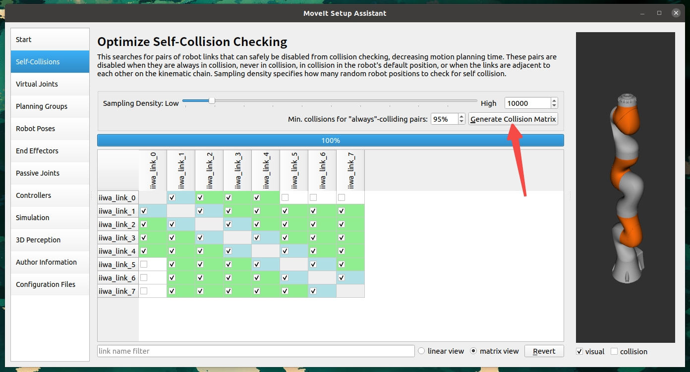

[ROS官方安装教程](https://wiki.ros.org/noetic/Installation/Ubuntu)

[MoveIt官方配置教程](https://moveit.github.io/moveit_tutorials/doc/getting_started/getting_started.html)

[MoveIt Setup Assistant教程](https://moveit.github.io/moveit_tutorials/doc/setup_assistant/setup_assistant_tutorial.html)

下面，我们以Ubuntu20.04为例，[安装ROS1(Noetic)](#ros安装)并[配置MoveIt环境](#moveit配置和安装)进行机械臂的控制以及在Gazebo中完成仿真。
# ROS安装
## 一键安装
```bash
wget -c https://raw.githubusercontent.com/qboticslabs/ros_install_noetic/master/ros_install_noetic.sh && chmod +x ./ros_install_noetic.sh && ./ros_install_noetic.sh
```

##  手动安装
1. 找到系统中的"**软件和更新**"程序，勾选"**restricted**," "**universe**," 还有 "**multiverse**" ，如下图所示：


2. 配置`sources.list`，打开终端(Ctrl+Alt+t)
```bash
sudo sh -c 'echo "deb http://packages.ros.org/ros/ubuntu $(lsb_release -sc) main" > /etc/apt/sources.list.d/ros-latest.list'
```

3. 配置访问Key
```bash
sudo apt install curl       # 确保curl已安装
curl -s https://raw.githubusercontent.com/ros/rosdistro/master/ros.asc | sudo apt-key add -
```

4. 更新软件源并安装ROS
```bash
sudo apt update
sudo apt install ros-noetic-desktop-full # 推荐全量安装
```

5. 环境变量配置(如果同时存在多个ROS系统，建议进行如下配置)
```bash
source /opt/ros/noetic/setup.bash   # 每新开一个终端都要进行配置，以配置不同的ROS系统
```
如果只存在一个ROS系统，可以直接将其添加到系统环境变量(之后无需配置临时环境变量)：
```bash
echo "source /opt/ros/noetic/setup.bash" >> ~/.bashrc
source ~/.bashrc
```

6. 为ROS安装package依赖
```bash
sudo apt install python3-rosdep python3-rosinstall python3-rosinstall-generator python3-wstool build-essential
```

7. 安装并初始化rosdep(依赖管理工具)
```bash
sudo apt install python3-rosdep
sudo rosdep init
rosdep update
```

至此，我们已经完成ROS的安装。接下来，我们需要完成MoveIt的配置：

# MoveIt配置和安装
1. 更新软件源
```bash
rosdep update
sudo apt update
sudo apt dist-upgrade
```

2. 安装构建工具
```bash
sudo apt install ros-noetic-catkin python3-catkin-tools
sudo apt install python3-wstool
```

3. 创建工作区
> 可以自行修改路径，这里我在`home`中创建了`workspace`总工作空间，并在其中创建`moveit`工作空间
```bash
mkdir -p ~/workspace/ws_moveit/src
cd ~/workspace/ws_moveit/src
```

4. 构建工作区
```bash
# 使用二进制包安装MoveIt（比从源码构建更快）
sudo apt install ros-noetic-moveit

# 安装MoveIt附加组件
sudo apt install ros-noetic-moveit-ros-visualization ros-noetic-moveit-planners ros-noetic-moveit-ros-move-group ros-noetic-moveit-ros-perception

# 安装依赖项
cd ~/workspace/ws_moveit/src

# 克隆教程和示例(不必，之后我们会使用URDF文件创建自己的package)
```
至此，我们已经完成基础环境的搭建。之后自行选择合适的机械臂完成配置：

# 导出机械臂相应pkg并安装依赖
这里推荐一个开源URDF文件数据集[awesome-robot-descriptions](https://github.com/robot-descriptions/awesome-robot-descriptions)

我们以`iiwa7机械臂`为例，完成作业要求

1. 下载urdf文件
```bash
cd 替换为实际路径/ws_moveit/src
git clone https://github.com/facebookresearch/differentiable-robot-model.git
```
2. 使用`MoveIt Setup Assistant`导出机械臂package
```bash
sudo apt install ros-noetic-franka-description      # 确保相关程序已安装
roslaunch moveit_setup_assistant setup_assistant.launch
```

- 成功运行后，如图所示点击`Create New MoveIt Configuration Package`：

- 点击`Browse`

- 找到我们的`iiwa7.urdf`文件，双击即可

- 成功加载后会显示机械臂模型


> 注意：如果在加载URDF文件时出现找不到mesh文件的错误，请参考[附录A：解决mesh文件路径问题](#附录a解决mesh文件路径问题)进行修复。

3. 配置机器人组件
   - 自碰撞矩阵配置：点击`Self-Collisions`，然后点击`Generate Collision Matrix`。
   
   
   
   - 虚拟关节配置：点击`Virtual Joints`，添加一个虚拟关节，将机器人固定在世界坐标系。
     - 名称：`virtual_joint`
     - 子链接：`iiwa_link_0`（机器人的基座链接）
     - 父链接：`world`
     - 类型：`fixed`
     
   
   
   - 规划组配置：点击`Planning Groups`，创建一个规划组
     - 名称：`manipulator`
     - 运动学求解器：`KDLKinematicsPlugin`
     - 组配置：包含所有关节（`iiwa_joint_1`到`iiwa_joint_7`）
     
   
   
   
   - 机器人姿态配置：点击`Robot Poses`，添加常用姿态
     - 名称：`home`（回原位姿态）
     - 设置关节角度为初始位置
     - 这里均设置为`0`
     
   
   
   - 末端执行器配置：点击`End Effectors`，添加末端执行器
     - 名称：`end_effector`
     - 组：`manipulator`
     - 父链接：`iiwa_link_7`（机器人的末端链接）
     
   

   - 作者信息填写：点击`Author Information`，自行填写作者信息
     - 维护者名称
     - 维护者邮箱

   

4. 生成配置文件
   - 点击`Configuration Files`
   - 填写配置包的基本信息
     - 名称：`iiwa7_moveit_config`
     - 路径：选择保存的目录，如`~/workspace/ws_moveit/src`
   - 点击`Generate Package`生成配置包
   
   

5. 构建MoveIt配置包
```bash
cd ~/workspace/ws_moveit
catkin build
source devel/setup.bash
```

6. 启动MoveIt演示
```bash
roslaunch iiwa7_moveit_config demo.launch
```

这将启动RViz，显示iiwa7机械臂的模型，并可以通过MoveIt插件进行规划和控制。


# 机械臂控制
我们已经完成机械臂的配置和导入，接下来，我们将实现机械臂的点位控制和轨迹控制，包括8字形轨迹、椭圆轨迹和*螺旋轨迹*（或其它控制性能，我觉得实现一个键盘操控+鼠标跟随也是可以的）。

## 创建控制包

首先，我们需要创建一个新的ROS包来实现机械臂控制功能：

```bash
# 进入工作空间的src目录
cd ~/workspace/ws_moveit/src

# 创建一个新的ROS包，依赖于MoveIt等相关包
catkin_create_pkg iiwa7_control moveit_ros_planning_interface roscpp rospy std_msgs geometry_msgs

# 创建脚本目录
cd iiwa7_control
mkdir -p scripts
```

接下来，我们可以参考[MoveIt Python Interface教程](https://moveit.github.io/moveit_tutorials/doc/move_group_python_interface/move_group_python_interface_tutorial.html)完成任务。
官方教程十分完善，涉及到很多基础操作和模块。在本项目中，我们会继续指出跟随官方教程可能出现的问题并提出参考解决方案。

我们将参考官方教程示例代码实现具体代码，并将相关功能封装到类（控制器类:`PointControl`）

## 点位控制

点位控制是指控制机械臂的末端执行器按顺序运动到空间中的多个预定义点位。下面我们实现一个Python脚本，控制机械臂运动到6个不同的空间点位：

```bash
# 创建点位控制脚本
touch scripts/point_control.py
chmod +x scripts/point_control.py
```

在[`point_control.py`](./src/iiwa7_control/scripts/point_control.py)中实现以下功能：
### 1. 初始化并获取基本信息
- 初始化ROS节点和MoveIt Commander。
- 获取机器人基本信息，如规划坐标系、末端执行器名称。
- 创建用于在RViz中可视化MoveIt规划轨迹的Publisher。

### 2. 核心控制方法
- `move_J(joint_goal_array)`: 控制机械臂各关节运动到指定的目标角度。
- `go_to(pose_goal)`: 控制机械臂末端执行器运动到空间中的目标位姿 (位置和姿态)。
- `plan_cartesian_path(waypoints)`: 根据给定的路径点列表（`geometry_msgs.msg.Pose`对象），规划笛卡尔空间下的直线运动路径。
- `execute_plan(plan)`: 执行先前规划好的机器人轨迹。

### 3. 交互式六边形轨迹控制 (基于当前末端姿态)
`point_control.py` 脚本在空间中绘制一个正六边形。其特点如下：

- **交互式初始位姿确定**:
    1. 脚本首先会控制机械臂移动到一个预定义的"准备"关节姿态。
    2. 然后程序会暂停，等待用户在RViz中观察并调整（如果需要，可以通过RViz的交互工具微调目标姿态，尽管脚本本身不直接处理这种外部调整）或仅仅是确认当前末端执行器的位姿。
    3. 用户按下回车键后，脚本会捕获末端执行器当前的完整世界位姿（包括位置和姿态/朝向）。

- **六边形平面与中心的定义**:
    - **中心**: 捕获到的末端执行器的世界位置将作为生成六边形的中心点。
    - **平面朝向**: 捕获到的末端执行器的世界姿态（朝向）将决定六边形所在的平面。这意味着六边形会绘制在末端执行器"前方"的、与其当前朝向对齐的平面上。如果末端执行器是水平的，六边形也是水平的；如果末端执行器是倾斜的，六边形也会相应倾斜。
    - **顶点计算**: 六边形的顶点首先在末端执行器的局部坐标系（XY平面，Z为0）中计算，然后通过捕获到的世界位姿变换到世界坐标系中。

- **固定姿态与闭合路径**:
    - **姿态保持**: 在绘制六边形的过程中，末端执行器会尝试保持其在初始捕获时刻的那个姿态。
    - **路径闭合**: 在经过六边形的6个顶点后，脚本会自动添加第7个路径点，该点与六边形的第1个顶点相同，从而使机械臂的运动轨迹形成一个闭合的六边形。

- **参数可调**:
    - 六边形的半径 (`radius`) 可以在脚本的 `run()` 方法中方便地修改。

### 4. 路径可视化增强：Marker显示
为了更清晰地展示期望的末端执行器路径（例如绘制的六边形），除了MoveIt默认的规划路径显示外，`point_control.py` 还增加了以下功能：

- **发布Marker消息**: 脚本会创建一个 `visualization_msgs/Marker` 类型的消息 (具体为 `LINE_STRIP`)，其中包含六边形所有路径点的位置。
- **Marker话题**: 此Marker消息会发布到 `/eef_trajectory_marker` 话题。
- **RViz中配置**:
    1. 在RViz的左侧"Displays"面板中，点击"Add"按钮。
    2. 选择"Marker"显示类型（通常在 `rviz` 或 `visualization_msgs` 分类下）。
    3. 选中新添加的"Marker"Display，在其属性中找到"Marker Topic"一项。
    4. 将其值修改为 `/eef_trajectory_marker`。
    5. 完成后，应该能在RViz中看到一条独立的、默认为红色的线状轨迹，精确地描绘出程序计算出的六边形路径点。

### 5. 运行控制
（运行控制的指令与下方"构建并运行"部分一致，确保先启动 `demo.launch`）

## 轨迹控制

轨迹控制是指控制机械臂的末端执行器按照特定轨迹运动，如8字形、椭圆和螺旋轨迹。以下是实现的代码：

```bash
# 创建轨迹控制脚本
touch scripts/trajectory_control.py
chmod +x scripts/trajectory_control.py
```

在`trajectory_control.py`中实现以下功能：


## 构建并运行

编译工作空间并运行控制脚本：

```bash
# 构建工作空间
cd ~/workspace/ws_moveit
catkin build
source devel/setup.bash

# 先启动MoveIt演示环境
roslaunch iiwa7_moveit_config demo.launch
```

在另一个终端中运行点位控制或轨迹控制：

```bash
# 点位控制
source ~/workspace/ws_moveit/devel/setup.bash
rosrun iiwa7_control point_control.py

# 或者轨迹控制
source ~/workspace/ws_moveit/devel/setup.bash
rosrun iiwa7_control trajectory_control.py
```

## 控制效果

1. 点位控制：机械臂的末端执行器会依次移动到6个预定义的空间点位，形成一个空间闭合路径。
   

2. 8字形轨迹：机械臂的末端执行器会在垂直平面内画出一个8字形轨迹。
   

3. 椭圆轨迹：机械臂的末端执行器会在垂直平面内画出一个椭圆轨迹。
   

4. 螺旋轨迹：机械臂的末端执行器会沿着一个螺旋路径前进，同时半径逐渐减小。
   

## 代码分析

1. **初始化**：脚本首先初始化了MoveIt的各种组件，包括RobotCommander、PlanningSceneInterface和MoveGroupCommander，这些组件用于和MoveIt框架交互。同时设置规划时间限制为15秒，比默认的5秒要长，有助于复杂路径的规划。

2. **位姿控制**：使用`go_to_pose_goal`方法实现末端执行器位姿的控制，可以指定空间中的位置和姿态。

3. **笛卡尔路径规划**：使用`plan_cartesian_path`方法规划笛卡尔路径，通过指定一系列中间点位来生成轨迹。它接收三个参数：
   - `waypoints`：路径点列表
   - `eef_step`：末端执行器的步长（0.01m）
   - `jump_threshold`：跳跃阈值（0.0表示不限制）

4. **轨迹生成**：
   - 8字形轨迹：使用参数方程 y = scale * sin(θ), z = scale * sin(2θ) / 2 + offset
   - 椭圆轨迹：使用参数方程 y = a * cos(θ), z = b * sin(θ) + offset
   - 螺旋轨迹：使用参数方程 y = r * cos(θ), z = r * sin(θ) + offset, x = x₀ + height * t / steps

5. **轨迹执行**：使用`execute_plan`方法执行规划好的轨迹，实现机械臂的平滑运动。

使用这种基于MoveIt的轨迹规划和执行方法，可以实现机械臂的复杂运动，同时利用MoveIt的碰撞检测功能确保运动安全。

## 故障排除

如果在执行轨迹时遇到类似"Unable to sample any valid states for goal tree"的错误，可以尝试以下解决方法：

1. 减小轨迹的幅度（scale、radius等参数）
2. 减少路径点的数量（steps参数）
3. 调整起始位置，确保轨迹在机械臂的工作空间内
4. 增加规划时间限制（可通过设置move_group的planning_time参数）

请确保`compute_cartesian_path`方法包含必要的参数（路径点、步长、跳跃阈值和避免碰撞标志）。

### 笛卡尔路径规划失败或fraction为0（机械臂不动）

如果 `compute_cartesian_path` 返回的 `fraction` 很低（例如0.0）或者机械臂在尝试执行笛卡尔路径时没有移动，即使没有明显错误，也可能存在以下问题：

*   **起始姿态接近奇异点**：许多机械臂（包括iiwa7）在完全伸直或某些特定关节角度组合时会处于奇异状态。在奇异点附近，机械臂的雅可比矩阵会变得病态，导致逆运动学求解困难，从而使得笛卡尔空间下的直线运动规划失败。
    *   **解决方案**：在开始任何笛卡尔路径规划（如点位控制或复杂轨迹跟踪）之前，建议首先将机械臂通过**关节空间规划**移动到一个已知的、非奇异的"准备"姿态。例如，可以将所有关节移动到微小偏移的非零角度。
      ```python
      # 示例：移动到一个初始的非奇异关节姿态 (在控制脚本中)
      joint_goal = [0.0, np.deg2rad(20), 0.0, np.deg2rad(-70), 0.0, np.deg2rad(90), 0.0]
      controller.move_J(joint_goal)
      ```

*   **目标点不可达或路径上有障碍物**：确保规划的目标点在机械臂的可达工作空间内，并且路径上没有未知的障碍物（如果启用了碰撞检测）。
*   **笛卡尔路径本身不可行**：即使目标点可达，但如果要求的直线路径导致机械臂关节超出限制或进入自碰撞，规划也会失败。尝试将路径分解为更小的分段，或允许通过中间点进行关节空间移动。
*   **规划时间不足**：对于复杂的笛卡尔路径，默认的规划时间可能不够。可以尝试增加规划时间（例如，在 `Iiwa7Controller` 的 `__init__` 方法中，或者在规划前临时设置）：
    ```python
    # self.move_group.set_planning_time(15.0) # 增加规划时间
    ```

# 附录
## 附录A：解决mesh文件路径问题

如果在加载URDF文件时出现以下错误：
```
Error retrieving file [meshes/iiwa7/collision/link_0.stl]: Could not resolve host: meshes
```

这是因为URDF文件中的mesh文件路径不正确。需要修改URDF文件中的mesh路径，添加`package://`前缀并指向正确的包路径：

```bash
# 找到URDF文件
find ~/workspace/ws_moveit/src -name "iiwa7.urdf"

# 编辑URDF文件，将所有mesh路径从类似
# <mesh filename="meshes/iiwa7/visual/link_0.stl"/>
# 修改为
# <mesh filename="package://differentiable-robot-model/diff_robot_data/kuka_iiwa/meshes/iiwa7/visual/link_0.stl"/>
```

此外，还需要将differentiable-robot-model目录配置为ROS包，以便ROS能够找到这些文件：

```bash
# 创建package.xml文件
cd ~/workspace/ws_moveit/src/differentiable-robot-model
cat > package.xml << EOL
<?xml version="1.0"?>
<package format="2">
  <name>differentiable-robot-model</name>
  <version>0.1.0</version>
  <description>Differentiable Robot Model Package</description>

  <maintainer email="user@example.com">User</maintainer>
  <license>MIT</license>
  
  <buildtool_depend>catkin</buildtool_depend>
  <build_depend>roscpp</build_depend>
  <build_depend>rospy</build_depend>
  <build_depend>std_msgs</build_depend>
  
  <exec_depend>roscpp</exec_depend>
  <exec_depend>rospy</exec_depend>
  <exec_depend>std_msgs</exec_depend>
  
  <export>
  </export>
</package>
EOL
```

```bash
# 创建CMakeLists.txt文件
cat > CMakeLists.txt << EOL
cmake_minimum_required(VERSION 3.0.2)
project(differentiable-robot-model)

find_package(catkin REQUIRED COMPONENTS
  roscpp
  rospy
  std_msgs
)

catkin_package(
  CATKIN_DEPENDS roscpp rospy std_msgs
)

include_directories(
  \${catkin_INCLUDE_DIRS}
)

## Mark mesh files for installation
install(DIRECTORY diff_robot_data
  DESTINATION \${CATKIN_PACKAGE_SHARE_DESTINATION}
  FILES_MATCHING PATTERN "*.stl" PATTERN "*.urdf" PATTERN "*.xacro"
)
EOL
```

```bash
# 重新构建工作空间
cd ~/workspace/ws_moveit
catkin build
source devel/setup.bash
```

修改后再次运行Setup Assistant：
```bash
roslaunch moveit_setup_assistant setup_assistant.launch
```

修复后应该可以成功加载机械臂模型。

## 附录B：六边形顶点坐标变换推导

在 `point_control.py` 脚本的交互式六边形绘制功能中，核心步骤之一是将局部计算的六边形顶点变换到世界坐标系中，该变换基于用户确认时末端执行器的实时位姿。以下是这个变换过程的简要推导：

**1. 目标**

我们希望在末端执行器当前位置和姿态所定义的"前方"平面上绘制一个正六边形。

**2. 初始信息**

- 末端执行器在世界坐标系下的位姿，捕获自用户确认时刻：
    - 世界位置: $ P_{ee\_world} = (x_w, y_w, z_w) $
    - 世界姿态 (四元数): $ Q_{ee\_world} = (q_x, q_y, q_z, q_w) $
- 六边形用户定义参数：
    - 半径: $ r $
    - 顶点数量: $ N $ (脚本中固定为6)

**3. 步骤1：在末端执行器的局部坐标系中计算顶点**

首先，我们在末端执行器的局部坐标系中定义六边形的顶点。我们假设六边形的中心位于该局部坐标系的原点 $(0,0,0)$，并且六边形"平躺"在该局部坐标系的XY平面上 (即局部Z坐标为0)。

对于第 $i$ 个顶点 (其中 $i$ 从 0 到 $N-1$)，其在局部坐标系中的坐标 $V_{local,i} = (x_{local,i}, y_{local,i}, z_{local,i})$ 计算如下：

$$ x_{local,i} = r \cdot \cos\left(\frac{2\pi i}{N}\right) $$
$$ y_{local,i} = r \cdot \sin\left(\frac{2\pi i}{N}\right) $$
$$ z_{local,i} = 0 $$

为了进行后续的齐次坐标变换，我们将每个局部顶点表示为一个齐次坐标列向量：
$$ V_{local,i} = \begin{bmatrix} x_{local,i} \\ y_{local,i} \\ 0 \\ 1 \end{bmatrix} $$

**4. 步骤2：构建从局部坐标系到世界坐标系的变换矩阵**

为了将局部坐标系下的顶点转换到世界坐标系，我们需要一个 $4 \times 4$ 的齐次变换矩阵 $T_{world\_from\_local}$。这个矩阵同时包含了旋转和平移操作，可以将点从末端执行器的局部坐标系映射到世界坐标系。

该矩阵的结构如下：

$$
T_{world\_from\_local} = \begin{bmatrix}
R_{world\_from\_local} & P_{ee\_world} \\
\begin{matrix} 0 & 0 & 0 \end{matrix} & 1
\end{bmatrix}
$$

其中：
- $R_{world\_from\_local}$ 是一个 $3 \times 3$ 的旋转矩阵，它根据末端执行器在世界坐标系中的姿态四元数 $Q_{ee\_world}$ 计算得到。它描述了局部坐标系的轴相对于世界坐标系轴的旋转关系。
- $P_{ee\_world}$ 是一个 $3 \times 1$ 的平移列向量，代表末端执行器（即局部坐标系原点）在世界坐标系中的位置 $(x_w, y_w, z_w)^T$。

在Python脚本中，我们利用 `tf.transformations.quaternion_matrix(eef_orientation_list)` 来获取一个基于四元数的 $4 \times 4$ 矩阵。这个函数返回的矩阵的左上角 $3 \times 3$ 部分就是我们需要的旋转矩阵 $R_{world\_from\_local}$，其最后一列的前三个元素初始可能为0。我们随后手动将世界位置 $P_{ee\_world}$ 填充到这个矩阵的最后一列（平移部分）：

```python
# eef_orientation_list 是从 Q_ee_world 转换来的列表 [qx, qy, qz, qw]
T_world_from_local = quaternion_matrix(eef_orientation_list)

# 设置平移部分
T_world_from_local[0,3] = hexagon_center_pose_world.position.x # x_w
T_world_from_local[1,3] = hexagon_center_pose_world.position.y # y_w
T_world_from_local[2,3] = hexagon_center_pose_world.position.z # z_w
```

**5. 步骤3：将局部顶点变换到世界坐标系**

对于每一个在局部坐标系中计算得到的齐次顶点 $V_{local,i}$，我们可以通过左乘变换矩阵 $T_{world\_from\_local}$ 来得到其在世界坐标系中的齐次坐标 $V_{world,i}$：

$$ V_{world,i} = T_{world\_from\_local} \cdot V_{local,i} $$

展开后，$V_{world,i} = [x_{world,i}, y_{world,i}, z_{world,i}, 1]^T$。我们提取其前三个元素 $(x_{world,i}, y_{world,i}, z_{world,i})$ 作为该顶点在世界坐标系下的笛卡尔坐标。

**6. 最终的路径点**

每个计算出的世界坐标顶点 $(x_{world,i}, y_{world,i}, z_{world,i})$ 与最初捕获的末端执行器世界姿态四元数 $Q_{ee\_world}$ (作为目标姿态) 一起，构成了一个完整的路径点 (`geometry_msgs.msg.Pose` 对象)，用于后续的笛卡尔路径规划。
