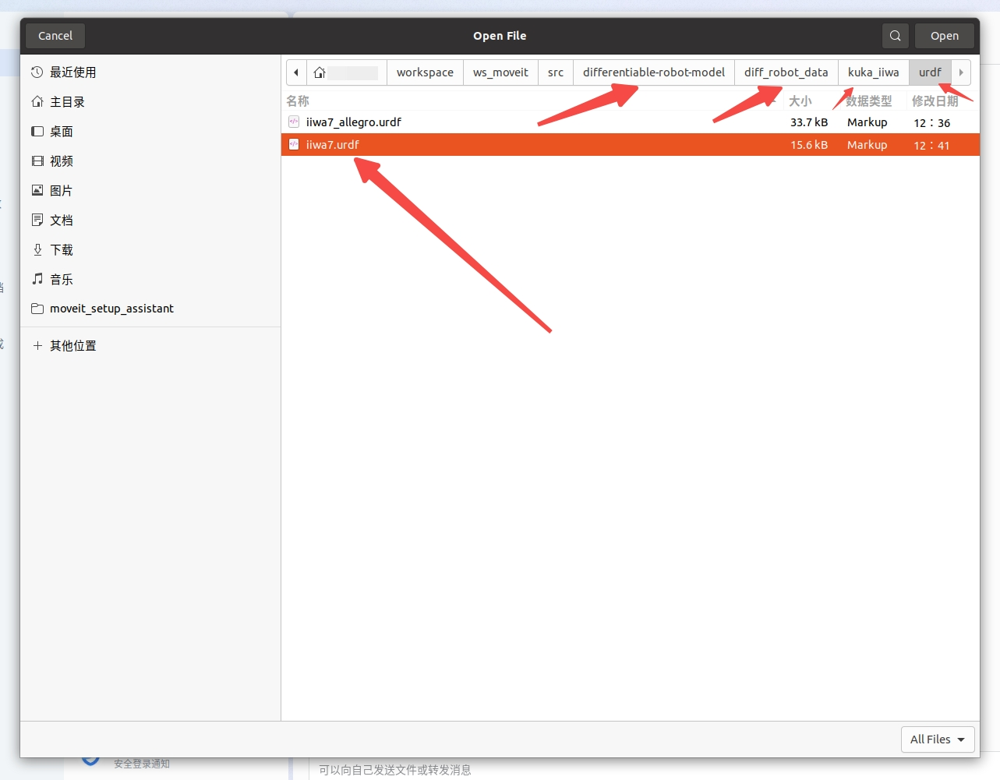
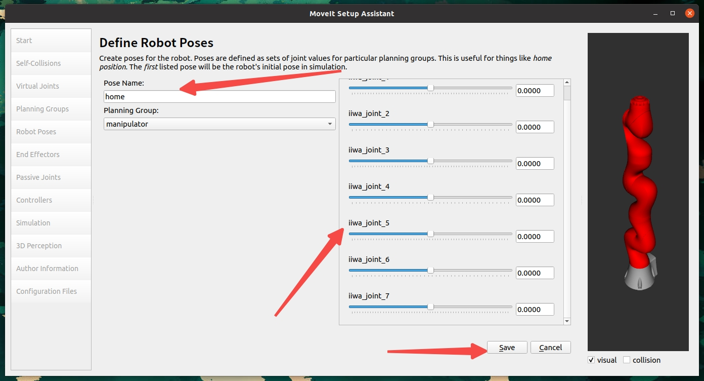
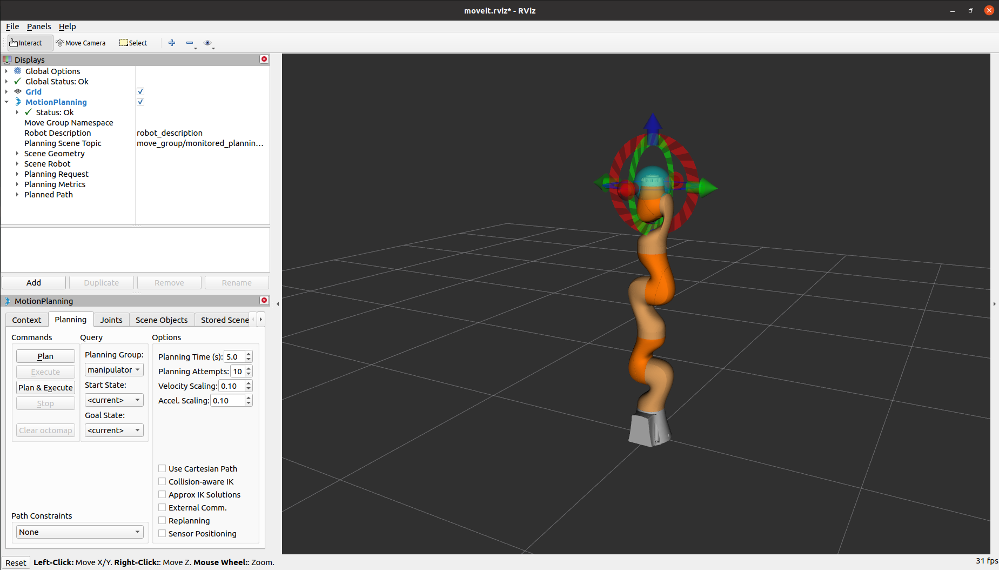
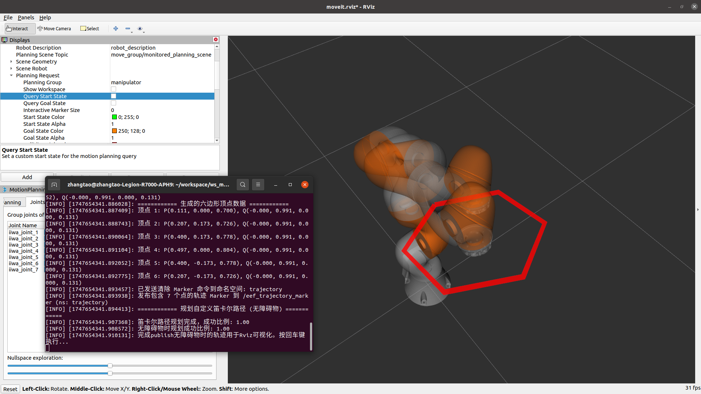

[ROS官方安装教程](https://wiki.ros.org/noetic/Installation/Ubuntu)

[MoveIt官方配置教程](https://moveit.github.io/moveit_tutorials/doc/getting_started/getting_started.html)

[MoveIt Setup Assistant教程](https://moveit.github.io/moveit_tutorials/doc/setup_assistant/setup_assistant_tutorial.html)

下面，我们以Ubuntu20.04为例，[安装ROS1(Noetic)](#ros安装)并[配置MoveIt环境](#moveit配置和安装)进行机械臂的控制以及在Gazebo中完成仿真。
# ROS安装
## 一键安装
```bash
wget -c https://raw.githubusercontent.com/qboticslabs/ros_install_noetic/master/ros_install_noetic.sh && chmod +x ./ros_install_noetic.sh && ./ros_install_noetic.sh
```

##  手动安装
1. 找到系统中的"**软件和更新**"程序，勾选"**restricted**," "**universe**," 还有 "**multiverse**" ，如下图所示：


2. 配置`sources.list`，打开终端(Ctrl+Alt+t)
```bash
sudo sh -c 'echo "deb http://packages.ros.org/ros/ubuntu $(lsb_release -sc) main" > /etc/apt/sources.list.d/ros-latest.list'
```

3. 配置访问Key
```bash
sudo apt install curl       # 确保curl已安装
curl -s https://raw.githubusercontent.com/ros/rosdistro/master/ros.asc | sudo apt-key add -
```

4. 更新软件源并安装ROS
```bash
sudo apt update
sudo apt install ros-noetic-desktop-full # 推荐全量安装
```

5. 环境变量配置(如果同时存在多个ROS系统，建议进行如下配置)
```bash
source /opt/ros/noetic/setup.bash   # 每新开一个终端都要进行配置，以配置不同的ROS系统
```
如果只存在一个ROS系统，可以直接将其添加到系统环境变量(之后无需配置临时环境变量)：
```bash
echo "source /opt/ros/noetic/setup.bash" >> ~/.bashrc
source ~/.bashrc
```

6. 为ROS安装package依赖
```bash
sudo apt install python3-rosdep python3-rosinstall python3-rosinstall-generator python3-wstool build-essential
```

7. 安装并初始化rosdep(依赖管理工具)
```bash
sudo apt install python3-rosdep
sudo rosdep init
rosdep update
```

至此，我们已经完成ROS的安装。接下来，我们需要完成MoveIt的配置：

# MoveIt配置和安装
1. 更新软件源
```bash
rosdep update
sudo apt update
sudo apt dist-upgrade
```

2. 安装构建工具
```bash
sudo apt install ros-noetic-catkin python3-catkin-tools
sudo apt install python3-wstool
```

3. 创建工作区
> 可以自行修改路径，这里我在`home`中创建了`workspace`总工作空间，并在其中创建`moveit`工作空间
```bash
mkdir -p ~/workspace/ws_moveit/src
cd ~/workspace/ws_moveit/src
```

4. 构建工作区
```bash
# 使用二进制包安装MoveIt（比从源码构建更快）
sudo apt install ros-noetic-moveit

# 安装MoveIt附加组件
sudo apt install ros-noetic-moveit-ros-visualization ros-noetic-moveit-planners ros-noetic-moveit-ros-move-group ros-noetic-moveit-ros-perception

# 安装依赖项
cd ~/workspace/ws_moveit/src

# 克隆教程和示例(不必，之后我们会使用URDF文件创建自己的package)
```
至此，我们已经完成基础环境的搭建。之后自行选择合适的机械臂完成配置：

# 导出机械臂相应pkg并安装依赖
这里推荐一个开源URDF文件数据集[awesome-robot-descriptions](https://github.com/robot-descriptions/awesome-robot-descriptions)

我们以`iiwa7机械臂`为例，完成作业要求

1. 下载urdf文件
```bash
cd 替换为实际路径/ws_moveit/src
git clone https://github.com/facebookresearch/differentiable-robot-model.git
```
2. 使用`MoveIt Setup Assistant`导出机械臂package
```bash
sudo apt install ros-noetic-franka-description      # 确保相关程序已安装
roslaunch moveit_setup_assistant setup_assistant.launch
```

- 成功运行后，如图所示点击`Create New MoveIt Configuration Package`：

- 点击`Browse`

- 找到我们的`iiwa7.urdf`文件，双击即可

- 成功加载后会显示机械臂模型


> 注意：如果在加载URDF文件时出现找不到mesh文件的错误，请参考[附录A：解决mesh文件路径问题](#附录a解决mesh文件路径问题)进行修复。

3. 配置机器人组件
   - 自碰撞矩阵配置：点击`Self-Collisions`，然后点击`Generate Collision Matrix`。
   
   
   
   - 虚拟关节配置：点击`Virtual Joints`，添加一个虚拟关节，将机器人固定在世界坐标系。
     - 名称：`virtual_joint`
     - 子链接：`iiwa_link_0`（机器人的基座链接）
     - 父链接：`world`
     - 类型：`fixed`
     
   
   
   - 规划组配置：点击`Planning Groups`，创建一个规划组
     - 名称：`manipulator`
     - 运动学求解器：`KDLKinematicsPlugin`
     - 组配置：包含所有关节（`iiwa_joint_1`到`iiwa_joint_7`）
     
   
   
   
   - 机器人姿态配置：点击`Robot Poses`，添加常用姿态
     - 名称：`home`（回原位姿态）
     - 设置关节角度为初始位置
     - 这里均设置为`0`
     
   
   
   - 末端执行器配置：点击`End Effectors`，添加末端执行器
     - 名称：`end_effector`
     - 组：`manipulator`
     - 父链接：`iiwa_link_7`（机器人的末端链接）
     
   

   - 作者信息填写：点击`Author Information`，自行填写作者信息
     - 维护者名称
     - 维护者邮箱

   

4. 生成配置文件
   - 点击`Configuration Files`
   - 填写配置包的基本信息
     - 名称：`iiwa7_moveit_config`
     - 路径：选择保存的目录，如`~/workspace/ws_moveit/src`
   - 点击`Generate Package`生成配置包
   
   

5. 构建MoveIt配置包
```bash
cd ~/workspace/ws_moveit
catkin build
source devel/setup.bash
```

6. 启动MoveIt演示
```bash
roslaunch iiwa7_moveit_config demo.launch
```

这将启动RViz，显示iiwa7机械臂的模型，并可以通过MoveIt插件进行规划和控制。


# 机械臂控制
我们已经完成机械臂的配置和导入，接下来，我们将实现机械臂的点位控制和轨迹控制，包括8字形轨迹、椭圆轨迹和螺旋轨迹。

## 创建控制包

首先，我们需要创建一个新的ROS包来实现机械臂控制功能：

```bash
# 进入工作空间的src目录
cd ~/workspace/ws_moveit/src

# 创建一个新的ROS包，依赖于MoveIt等相关包
catkin_create_pkg iiwa7_control moveit_ros_planning_interface roscpp rospy std_msgs geometry_msgs

# 创建脚本目录
cd iiwa7_control
mkdir -p scripts
```

## 点位控制

点位控制是指控制机械臂的末端执行器按顺序运动到空间中的多个预定义点位。下面我们实现一个Python脚本，控制机械臂运动到6个不同的空间点位：

```bash
# 创建点位控制脚本
touch scripts/point_control.py
chmod +x scripts/point_control.py
```

在`point_control.py`中实现以下功能：

```python
#!/usr/bin/env python3

import sys
import copy
import rospy
import moveit_commander
import moveit_msgs.msg
import geometry_msgs.msg
from math import pi, sin, cos
from std_msgs.msg import String
from moveit_commander.conversions import pose_to_list


class Iiwa7Controller:
    def __init__(self):
        # 初始化moveit_commander和rospy节点
        moveit_commander.roscpp_initialize(sys.argv)
        rospy.init_node('iiwa7_controller', anonymous=True)

        # 实例化RobotCommander对象，提供机器人运动学模型和当前的机器人状态
        robot = moveit_commander.RobotCommander()

        # 实例化PlanningSceneInterface对象，提供与环境交互的接口
        scene = moveit_commander.PlanningSceneInterface()

        # 实例化MoveGroupCommander对象，用于控制机器人的规划组
        group_name = "manipulator"  # 在MoveIt Setup Assistant中创建的规划组名称
        move_group = moveit_commander.MoveGroupCommander(group_name)

        # 设置规划时间限制为15秒（默认为5秒）
        move_group.set_planning_time(15.0)

        # 创建DisplayTrajectory发布者，用于显示轨迹
        display_trajectory_publisher = rospy.Publisher('/move_group/display_planned_path',
                                                       moveit_msgs.msg.DisplayTrajectory,
                                                       queue_size=20)

        # 保存引用
        self.robot = robot
        self.scene = scene
        self.move_group = move_group
        self.display_trajectory_publisher = display_trajectory_publisher

        # 获取规划参考坐标系的名称
        self.planning_frame = move_group.get_planning_frame()
        print("============ Planning frame: %s" % self.planning_frame)

        # 获取末端执行器链的名称
        self.eef_link = move_group.get_end_effector_link()
        print("============ End effector link: %s" % self.eef_link)

        # 获取机器人的所有组
        self.group_names = robot.get_group_names()
        print("============ Available Planning Groups:", self.group_names)

        # 打印机器人当前状态
        print("============ Printing robot state")
        print(robot.get_current_state())
        print("")

    def go_to_joint_state(self, joint_goal):
        """移动机械臂到指定的关节状态"""
        # 设置关节目标
        self.move_group.go(joint_goal, wait=True)
        # 调用stop()确保没有残留的运动
        self.move_group.stop()
        
        # 检查当前状态与目标状态是否接近
        current_joints = self.move_group.get_current_joint_values()
        return self.all_close(joint_goal, current_joints, 0.01)

    def go_to_pose_goal(self, pose_goal):
        """移动机械臂到指定的位姿"""
        # 设置位姿目标
        self.move_group.set_pose_target(pose_goal)

        # 调用规划器进行运动规划和执行
        plan = self.move_group.go(wait=True)
        # 确保没有残留的运动
        self.move_group.stop()
        # 清除目标位姿
        self.move_group.clear_pose_targets()

        # 检查当前位姿与目标位姿是否接近
        current_pose = self.move_group.get_current_pose().pose
        return self.all_close(pose_goal, current_pose, 0.01)

    def plan_cartesian_path(self, waypoints):
        """规划笛卡尔路径，通过指定的中间点"""
        # 使用compute_cartesian_path方法计算路径
        (plan, fraction) = self.move_group.compute_cartesian_path(
                                           waypoints,   # 路径点
                                           0.01,        # eef步长
                                           0.0)         # 跳跃阈值

        # 返回计算出的轨迹
        return plan, fraction

    def execute_plan(self, plan):
        """执行传入的轨迹计划"""
        self.move_group.execute(plan, wait=True)

    def all_close(self, goal, actual, tolerance):
        """
        判断一组关节角度或位姿是否足够接近
        """
        all_equal = True
        if type(goal) is list:
            for i in range(len(goal)):
                if abs(actual[i] - goal[i]) > tolerance:
                    return False
        elif type(goal) is geometry_msgs.msg.PoseStamped:
            return self.all_close(goal.pose, actual, tolerance)
        elif type(goal) is geometry_msgs.msg.Pose:
            return self.all_close(pose_to_list(goal), pose_to_list(actual), tolerance)
        return True

    def point_control_demo(self):
        """点位控制演示：控制机械臂运动到6个不同的空间点"""
        print("============ 执行点位控制演示")
        
        # 创建6个目标位姿
        pose_goals = []
        
        # 目标位姿1：前方伸直
        pose_goal1 = geometry_msgs.msg.Pose()
        pose_goal1.orientation.w = 1.0
        pose_goal1.position.x = 0.4
        pose_goal1.position.y = 0.0
        pose_goal1.position.z = 0.6
        pose_goals.append(pose_goal1)
        
        # 目标位姿2：右上方
        pose_goal2 = geometry_msgs.msg.Pose()
        pose_goal2.orientation.w = 1.0
        pose_goal2.position.x = 0.3
        pose_goal2.position.y = 0.3
        pose_goal2.position.z = 0.7
        pose_goals.append(pose_goal2)
        
        # 目标位姿3：右下方
        pose_goal3 = geometry_msgs.msg.Pose()
        pose_goal3.orientation.w = 1.0
        pose_goal3.position.x = 0.3
        pose_goal3.position.y = 0.3
        pose_goal3.position.z = 0.5
        pose_goals.append(pose_goal3)
        
        # 目标位姿4：左下方
        pose_goal4 = geometry_msgs.msg.Pose()
        pose_goal4.orientation.w = 1.0
        pose_goal4.position.x = 0.3
        pose_goal4.position.y = -0.3
        pose_goal4.position.z = 0.5
        pose_goals.append(pose_goal4)
        
        # 目标位姿5：左上方
        pose_goal5 = geometry_msgs.msg.Pose()
        pose_goal5.orientation.w = 1.0
        pose_goal5.position.x = 0.3
        pose_goal5.position.y = -0.3
        pose_goal5.position.z = 0.7
        pose_goals.append(pose_goal5)
        
        # 目标位姿6：返回初始位置
        pose_goal6 = geometry_msgs.msg.Pose()
        pose_goal6.orientation.w = 1.0
        pose_goal6.position.x = 0.4
        pose_goal6.position.y = 0.0
        pose_goal6.position.z = 0.6
        pose_goals.append(pose_goal6)
        
        # 依次执行6个目标位姿
        for i, pose_goal in enumerate(pose_goals):
            print(f"移动到目标位姿 {i+1}")
            self.go_to_pose_goal(pose_goal)
            rospy.sleep(1)  # 停顿1秒
        
        print("============ 点位控制演示完成!")

def main():
    try:
        controller = Iiwa7Controller()
        
        # 等待RViz显示
        print("等待RViz...")
        rospy.sleep(2)
        
        input("按 Enter 键开始点位控制演示...")
        controller.point_control_demo()
        
        print("演示完成!")

    except rospy.ROSInterruptException:
        return
    except KeyboardInterrupt:
        return

if __name__ == "__main__":
    main()
```

## 轨迹控制

轨迹控制是指控制机械臂的末端执行器按照特定轨迹运动，如8字形、椭圆和螺旋轨迹。以下是实现的代码：

```bash
# 创建轨迹控制脚本
touch scripts/trajectory_control.py
chmod +x scripts/trajectory_control.py
```

在`trajectory_control.py`中实现以下功能：

```python
#!/usr/bin/env python3

import sys
import copy
import rospy
import moveit_commander
import moveit_msgs.msg
import geometry_msgs.msg
from math import pi, sin, cos, sqrt
from std_msgs.msg import String
from moveit_commander.conversions import pose_to_list


class Iiwa7Controller:
    def __init__(self):
        # 初始化moveit_commander和rospy节点
        moveit_commander.roscpp_initialize(sys.argv)
        rospy.init_node('iiwa7_controller', anonymous=True)

        # 实例化RobotCommander对象，提供机器人运动学模型和当前的机器人状态
        robot = moveit_commander.RobotCommander()

        # 实例化PlanningSceneInterface对象，提供与环境交互的接口
        scene = moveit_commander.PlanningSceneInterface()

        # 实例化MoveGroupCommander对象，用于控制机器人的规划组
        group_name = "manipulator"  # 在MoveIt Setup Assistant中创建的规划组名称
        move_group = moveit_commander.MoveGroupCommander(group_name)

        # 创建DisplayTrajectory发布者，用于显示轨迹
        display_trajectory_publisher = rospy.Publisher('/move_group/display_planned_path',
                                                       moveit_msgs.msg.DisplayTrajectory,
                                                       queue_size=20)

        # 保存引用
        self.robot = robot
        self.scene = scene
        self.move_group = move_group
        self.display_trajectory_publisher = display_trajectory_publisher

        # 获取规划参考坐标系的名称
        self.planning_frame = move_group.get_planning_frame()
        print("============ Planning frame: %s" % self.planning_frame)

        # 获取末端执行器链的名称
        self.eef_link = move_group.get_end_effector_link()
        print("============ End effector link: %s" % self.eef_link)

        # 获取机器人的所有组
        self.group_names = robot.get_group_names()
        print("============ Available Planning Groups:", self.group_names)

        # 打印机器人当前状态
        print("============ Printing robot state")
        print(robot.get_current_state())
        print("")

    def go_to_pose_goal(self, pose_goal):
        """移动机械臂到指定的位姿"""
        # 设置位姿目标
        self.move_group.set_pose_target(pose_goal)

        # 调用规划器进行运动规划和执行
        plan = self.move_group.go(wait=True)
        # 确保没有残留的运动
        self.move_group.stop()
        # 清除目标位姿
        self.move_group.clear_pose_targets()

        # 检查当前位姿与目标位姿是否接近
        current_pose = self.move_group.get_current_pose().pose
        return self.all_close(pose_goal, current_pose, 0.01)

    def plan_cartesian_path(self, waypoints):
        """规划笛卡尔路径，通过指定的中间点"""
        # 使用compute_cartesian_path方法计算路径
        (plan, fraction) = self.move_group.compute_cartesian_path(
                                           waypoints,   # 路径点
                                           0.01,        # eef步长
                                           0.0)         # 跳跃阈值

        # 返回计算出的轨迹
        return plan, fraction

    def execute_plan(self, plan):
        """执行传入的轨迹计划"""
        self.move_group.execute(plan, wait=True)

    def all_close(self, goal, actual, tolerance):
        """
        判断一组关节角度或位姿是否足够接近
        """
        all_equal = True
        if type(goal) is list:
            for i in range(len(goal)):
                if abs(actual[i] - goal[i]) > tolerance:
                    return False
        elif type(goal) is geometry_msgs.msg.PoseStamped:
            return self.all_close(goal.pose, actual, tolerance)
        elif type(goal) is geometry_msgs.msg.Pose:
            return self.all_close(pose_to_list(goal), pose_to_list(actual), tolerance)
        return True

    def go_to_start_pose(self):
        """移动到轨迹的起始位置"""
        start_pose = geometry_msgs.msg.Pose()
        start_pose.orientation.w = 1.0
        start_pose.position.x = 0.4
        start_pose.position.y = 0.0
        start_pose.position.z = 0.5
        self.go_to_pose_goal(start_pose)
        return start_pose

    def figure_eight_demo(self, scale=0.1, steps=30):
        """生成并执行8字形轨迹"""
        print("============ 执行8字形轨迹演示")
        
        # 移动到起始位置
        start_pose = self.go_to_start_pose()
        
        # 创建轨迹点
        waypoints = []
        current_pose = copy.deepcopy(start_pose)
        
        # 生成8字形轨迹的参数方程点
        for t in range(steps):
            theta = 2.0 * pi * t / steps
            # 参数方程: x = a * sin(t), y = b * sin(t) * cos(t)
            # 为了生成一个水平的8字形
            current_pose.position.y = scale * sin(theta)             # y轴方向
            current_pose.position.z = scale * sin(2*theta) / 2 + 0.5 # z轴方向
            # 保持x位置不变
            
            waypoints.append(copy.deepcopy(current_pose))
        
        # 添加起始点闭合轨迹
        waypoints.append(copy.deepcopy(start_pose))
        
        # 规划笛卡尔路径
        plan, fraction = self.plan_cartesian_path(waypoints)
        print(f"规划完成: {fraction*100:.2f}% 的路径有效")
        
        # 执行轨迹
        if fraction > 0.5:  # 如果至少50%的路径有效
            self.execute_plan(plan)
        else:
            print("生成的轨迹不足够完整，放弃执行")
        
        print("============ 8字形轨迹演示完成!")

    def ellipse_demo(self, a=0.2, b=0.1, steps=50):
        """生成并执行椭圆轨迹"""
        print("============ 执行椭圆轨迹演示")
        
        # 移动到起始位置
        start_pose = self.go_to_start_pose()
        
        # 创建轨迹点
        waypoints = []
        current_pose = copy.deepcopy(start_pose)
        
        # 生成椭圆轨迹的参数方程点
        for t in range(steps):
            theta = 2.0 * pi * t / steps
            # 参数方程: x = a * cos(t), y = b * sin(t)
            # 为了生成一个竖直的椭圆
            current_pose.position.y = a * cos(theta)         # y轴方向
            current_pose.position.z = b * sin(theta) + 0.5   # z轴方向加上偏移
            # 保持x位置不变
            
            waypoints.append(copy.deepcopy(current_pose))
        
        # 添加起始点闭合轨迹
        waypoints.append(copy.deepcopy(start_pose))
        
        # 规划笛卡尔路径
        plan, fraction = self.plan_cartesian_path(waypoints)
        print(f"规划完成: {fraction*100:.2f}% 的路径有效")
        
        # 执行轨迹
        if fraction > 0.5:  # 如果至少50%的路径有效
            self.execute_plan(plan)
        else:
            print("生成的轨迹不足够完整，放弃执行")
        
        print("============ 椭圆轨迹演示完成!")

    def spiral_demo(self, radius=0.15, height=0.2, rounds=2, steps=100):
        """生成并执行螺旋轨迹"""
        print("============ 执行螺旋轨迹演示")
        
        # 移动到起始位置
        start_pose = self.go_to_start_pose()
        
        # 创建轨迹点
        waypoints = []
        current_pose = copy.deepcopy(start_pose)
        
        # 生成螺旋轨迹点
        max_angle = 2.0 * pi * rounds
        for t in range(steps):
            angle = max_angle * t / steps
            # 计算螺旋坐标
            r = radius * (1 - t / steps)  # 半径逐渐减小
            current_pose.position.y = r * cos(angle)         # y轴方向
            current_pose.position.z = r * sin(angle) + 0.5   # z轴方向
            current_pose.position.x = 0.4 + height * t / steps  # x轴向前移动
            
            waypoints.append(copy.deepcopy(current_pose))
        
        # 规划笛卡尔路径
        plan, fraction = self.plan_cartesian_path(waypoints)
        print(f"规划完成: {fraction*100:.2f}% 的路径有效")
        
        # 执行轨迹
        if fraction > 0.5:  # 如果至少50%的路径有效
            self.execute_plan(plan)
        else:
            print("生成的轨迹不足够完整，放弃执行")
        
        print("============ 螺旋轨迹演示完成!")

def main():
    try:
        controller = Iiwa7Controller()
        
        # 等待RViz显示
        print("等待RViz...")
        rospy.sleep(2)
        
        choice = input("""
请选择轨迹演示类型:
1. 8字形轨迹
2. 椭圆轨迹
3. 螺旋轨迹
请输入数字(1-3): """)
        
        if choice == '1':
            controller.figure_eight_demo()
        elif choice == '2':
            controller.ellipse_demo()
        elif choice == '3':
            controller.spiral_demo()
        else:
            print("无效选择，退出程序")
        
        print("演示完成!")

    except rospy.ROSInterruptException:
        return
    except KeyboardInterrupt:
        return

if __name__ == "__main__":
    main()
```

## 构建并运行

编译工作空间并运行控制脚本：

```bash
# 构建工作空间
cd ~/workspace/ws_moveit
catkin build
source devel/setup.bash

# 先启动MoveIt演示环境
roslaunch iiwa7_moveit_config demo.launch
```

在另一个终端中运行点位控制或轨迹控制：

```bash
# 点位控制
source ~/workspace/ws_moveit/devel/setup.bash
rosrun iiwa7_control point_control.py

# 或者轨迹控制
source ~/workspace/ws_moveit/devel/setup.bash
rosrun iiwa7_control trajectory_control.py
```

## 控制效果

1. 点位控制：机械臂的末端执行器会依次移动到6个预定义的空间点位，形成一个空间闭合路径。
   

2. 8字形轨迹：机械臂的末端执行器会在垂直平面内画出一个8字形轨迹。
   

3. 椭圆轨迹：机械臂的末端执行器会在垂直平面内画出一个椭圆轨迹。
   

4. 螺旋轨迹：机械臂的末端执行器会沿着一个螺旋路径前进，同时半径逐渐减小。
   

## 代码分析

1. **初始化**：脚本首先初始化了MoveIt的各种组件，包括RobotCommander、PlanningSceneInterface和MoveGroupCommander，这些组件用于和MoveIt框架交互。同时设置规划时间限制为15秒，比默认的5秒要长，有助于复杂路径的规划。

2. **位姿控制**：使用`go_to_pose_goal`方法实现末端执行器位姿的控制，可以指定空间中的位置和姿态。

3. **笛卡尔路径规划**：使用`plan_cartesian_path`方法规划笛卡尔路径，通过指定一系列中间点位来生成轨迹。它接收三个参数：
   - `waypoints`：路径点列表
   - `eef_step`：末端执行器的步长（0.01m）
   - `jump_threshold`：跳跃阈值（0.0表示不限制）

4. **轨迹生成**：
   - 8字形轨迹：使用参数方程 y = scale * sin(θ), z = scale * sin(2θ) / 2 + offset
   - 椭圆轨迹：使用参数方程 y = a * cos(θ), z = b * sin(θ) + offset
   - 螺旋轨迹：使用参数方程 y = r * cos(θ), z = r * sin(θ) + offset, x = x₀ + height * t / steps

5. **轨迹执行**：使用`execute_plan`方法执行规划好的轨迹，实现机械臂的平滑运动。

使用这种基于MoveIt的轨迹规划和执行方法，可以实现机械臂的复杂运动，同时利用MoveIt的碰撞检测功能确保运动安全。

## 故障排除

如果在执行轨迹时遇到类似"Unable to sample any valid states for goal tree"的错误，可以尝试以下解决方法：

1. 减小轨迹的幅度（scale、radius等参数）
2. 减少路径点的数量（steps参数）
3. 调整起始位置，确保轨迹在机械臂的工作空间内
4. 增加规划时间限制（可通过设置move_group的planning_time参数）

```python
# 设置规划时间限制
controller.move_group.set_planning_time(10.0)  # 设置为10秒
```

另外，如果遇到参数不匹配的错误，如：
```
Boost.Python.ArgumentError: Python argument types in
    MoveGroupInterface.compute_cartesian_path(MoveGroupInterface, list, float, float)
did not match C++ signature:
```

请确保`compute_cartesian_path`方法包含必要的参数（路径点、步长、跳跃阈值和避免碰撞标志）。

# 附录
## 附录A：解决mesh文件路径问题

如果在加载URDF文件时出现以下错误：
```
Error retrieving file [meshes/iiwa7/collision/link_0.stl]: Could not resolve host: meshes
```

这是因为URDF文件中的mesh文件路径不正确。需要修改URDF文件中的mesh路径，添加`package://`前缀并指向正确的包路径：

```bash
# 找到URDF文件
find ~/workspace/ws_moveit/src -name "iiwa7.urdf"

# 编辑URDF文件，将所有mesh路径从类似
# <mesh filename="meshes/iiwa7/visual/link_0.stl"/>
# 修改为
# <mesh filename="package://differentiable-robot-model/diff_robot_data/kuka_iiwa/meshes/iiwa7/visual/link_0.stl"/>
```

此外，还需要将differentiable-robot-model目录配置为ROS包，以便ROS能够找到这些文件：

```bash
# 创建package.xml文件
cd ~/workspace/ws_moveit/src/differentiable-robot-model
cat > package.xml << EOL
<?xml version="1.0"?>
<package format="2">
  <name>differentiable-robot-model</name>
  <version>0.1.0</version>
  <description>Differentiable Robot Model Package</description>

  <maintainer email="user@example.com">User</maintainer>
  <license>MIT</license>
  
  <buildtool_depend>catkin</buildtool_depend>
  <build_depend>roscpp</build_depend>
  <build_depend>rospy</build_depend>
  <build_depend>std_msgs</build_depend>
  
  <exec_depend>roscpp</exec_depend>
  <exec_depend>rospy</exec_depend>
  <exec_depend>std_msgs</exec_depend>
  
  <export>
  </export>
</package>
EOL
```

```bash
# 创建CMakeLists.txt文件
cat > CMakeLists.txt << EOL
cmake_minimum_required(VERSION 3.0.2)
project(differentiable-robot-model)

find_package(catkin REQUIRED COMPONENTS
  roscpp
  rospy
  std_msgs
)

catkin_package(
  CATKIN_DEPENDS roscpp rospy std_msgs
)

include_directories(
  \${catkin_INCLUDE_DIRS}
)

## Mark mesh files for installation
install(DIRECTORY diff_robot_data
  DESTINATION \${CATKIN_PACKAGE_SHARE_DESTINATION}
  FILES_MATCHING PATTERN "*.stl" PATTERN "*.urdf" PATTERN "*.xacro"
)
EOL
```

```bash
# 重新构建工作空间
cd ~/workspace/ws_moveit
catkin build
source devel/setup.bash
```

修改后再次运行Setup Assistant：
```bash
roslaunch moveit_setup_assistant setup_assistant.launch
```

修复后应该可以成功加载机械臂模型。